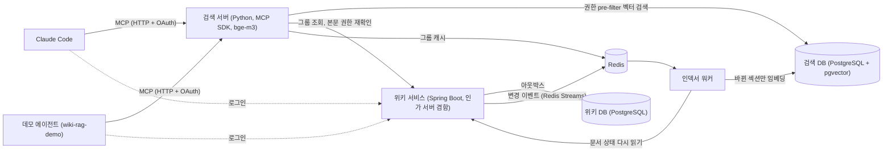
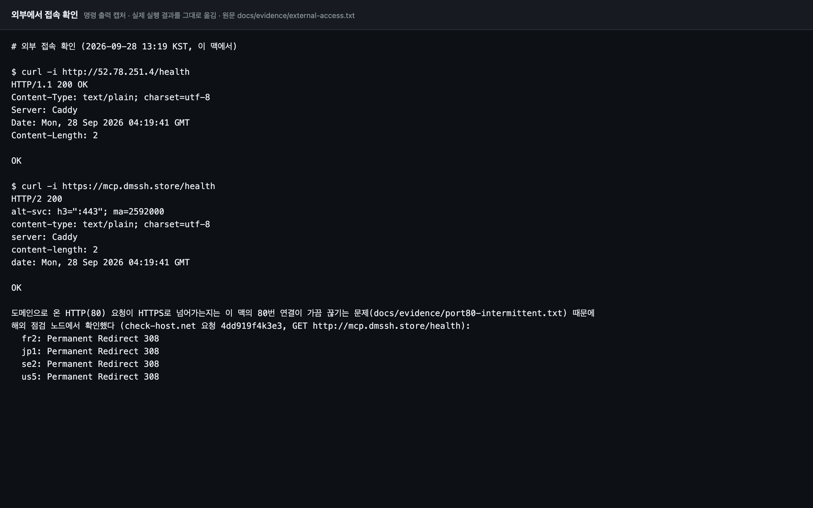
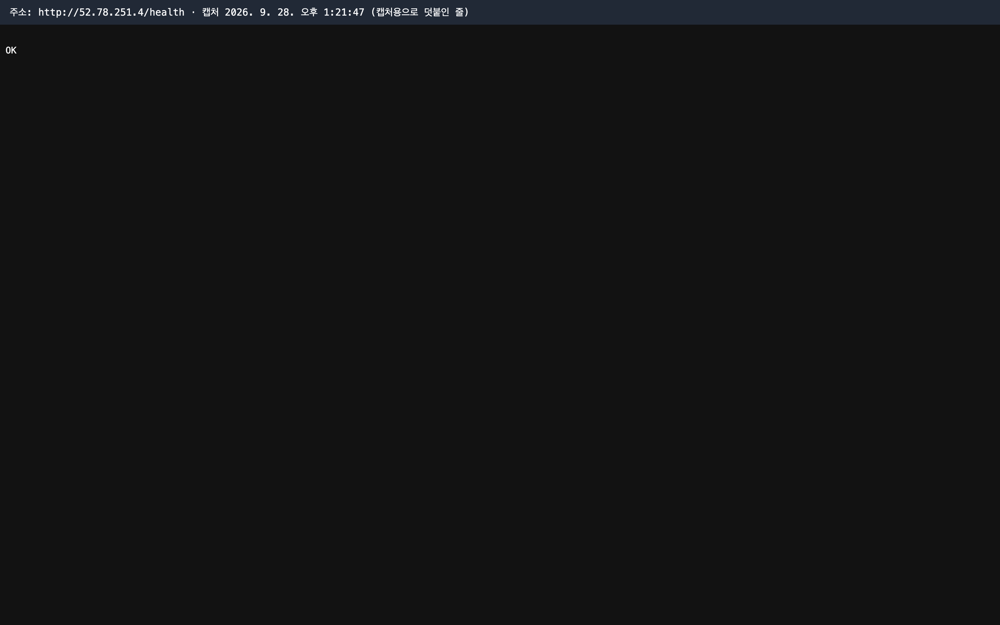
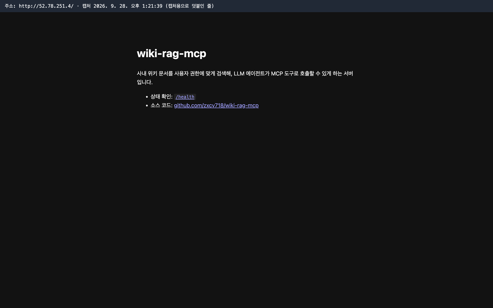
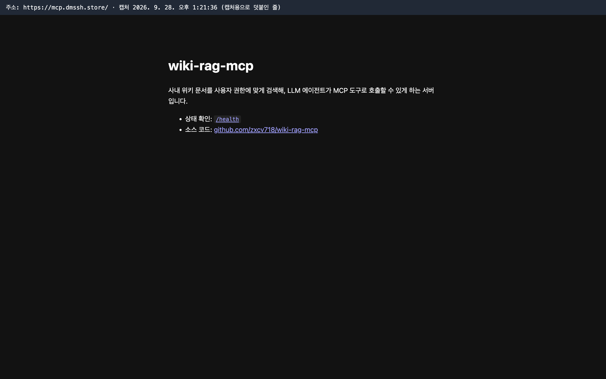
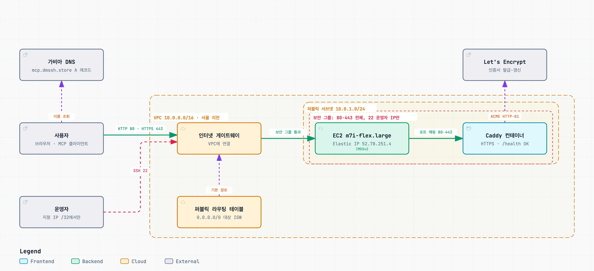
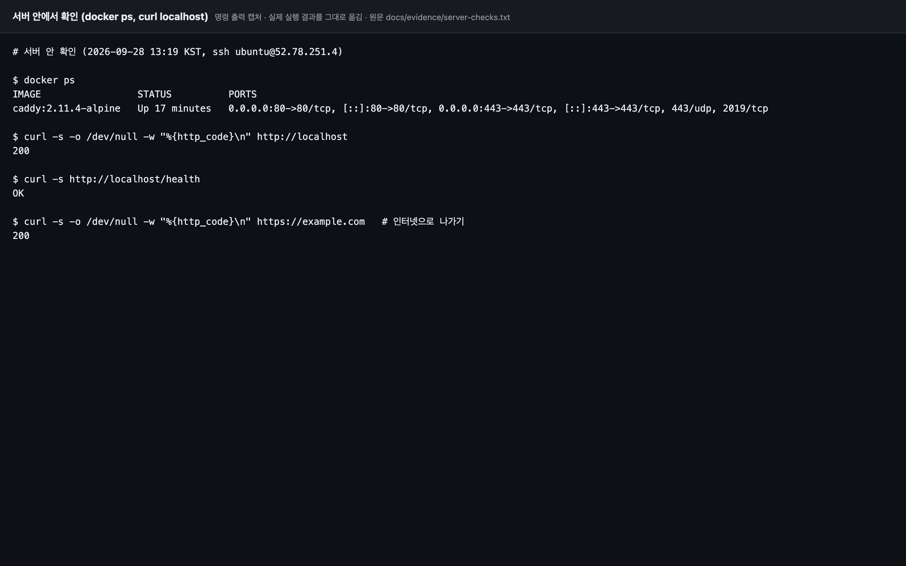
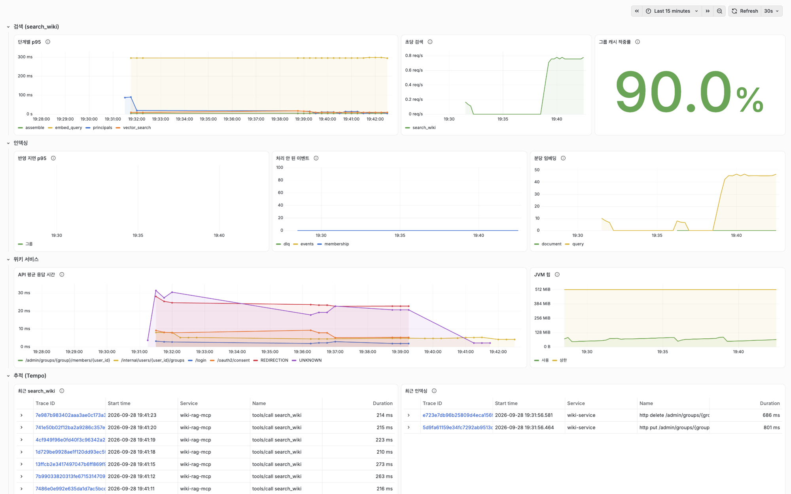
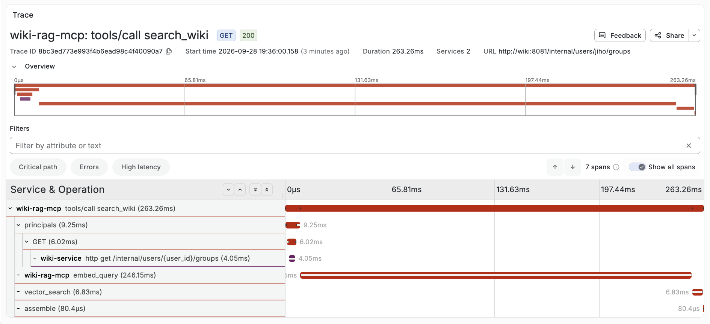
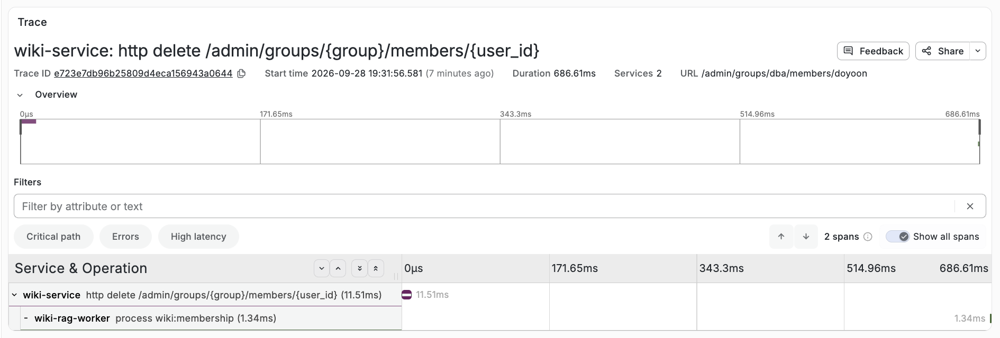

# wiki-rag-mcp

사내 위키 문서를 **사용자 권한에 맞게** 검색해, LLM 에이전트가 MCP 도구로 호출할 수 있게 하는 서버입니다. 답변은 만들지 않고 근거가 되는 문서 조각만 돌려주며, 권한 없는 문서는 검색 단계에서부터 제외합니다.

- **운영 서버**
  - MCP 서버: `https://mcp.dmssh.store/mcp` (Streamable HTTP + OAuth)
  - 인가 서버: `https://auth.dmssh.store`
- **문서**
  - 설계서: [`docs/design.md`](docs/design.md)
  - 결정 기록: [`docs/adr/`](docs/adr/README.md)
  - 실험 기록: [`experiments/`](experiments/README.md)
- **진행**
  - M1~M6 완료: MCP 서버, 골든셋 평가, 위키 서비스와 증분 인덱싱, 권한 pre-filter와 CI, OAuth와 배포, 관측성, 부하 측정, 데모 에이전트와 그 측정

## 같은 질문, 다른 답

가상 회사 "새솔소프트"의 위키(문서 200개, 사용자 11명)를 운영 서버에 올리고, 데모 에이전트로 세 사람이 같은 질문을 했습니다.

- **질문**: "운영 DB 비밀번호는 얼마마다 바꿔야 해?"
- **정답 문서**: `infra-007` "운영 DB 비밀번호 교체 절차"
  - 인프라 스페이스의 문서인데, 그 안에서도 DBA만 보도록 제한돼 있습니다.
  - 스페이스 권한과 문서 제한을 둘 다 만족해야 보입니다(ADR-21).

| 질문자 | 소속 | 검색에서 받은 문서 | 답 |
|---|---|---|---|
| `taeyang` | 인프라, DBA | `infra-007` 포함 | 운영 DB 관리자 계정 비밀번호는 60일마다 교체합니다 `[infra-007]` |
| `seoyeon` | 인프라 (DBA 아님) | `infra-007` 없음 | 운영 DB 전용 근거는 찾지 못했다고 말하고, 전사 계정 인증 정책을 안내합니다 |
| `minjun` | DBA (인프라 아님) | `infra-007` 없음 | 같음 |

- **흔적을 남기지 않습니다.** 권한이 없는 두 사람에게는 제한 문서가 검색 결과에 아예 나오지 않고, "1건 제외" 같은 안내도 없습니다.
- **본문도 한 번 더 막습니다.** 문서 id를 알아도 `get_document`에서 위키가 권한을 다시 판단해 막습니다(ADR-07).

`taeyang`이 받은 답입니다(2026-09-29, 운영 서버).

```text
운영 DB 관리자 계정 비밀번호는 **60일마다 교체**합니다. [infra-007]

참고로 일반 계정 비밀번호 정책 문서에는 다른 기준도 보이지만, 운영 DB에 대해서는 더 최근의 전용 문서인
**「운영 DB 비밀번호 교체 절차」**를 따르는 것이 맞습니다. 일반 계정 문서에는 90일 기준이 있으나
오래된 문서입니다. [infra-007][it-002]

출처
  [infra-007] 운영 DB 비밀번호 교체 절차 (버전 4, 2026-08-05 수정)
  [it-002] 계정 비밀번호 정책 (2024) (버전 5, 2024-02-05 수정)
```

## 목표와 결과

판정 기준은 모두 측정 전에 적었습니다. 방법과 신뢰구간, 원본 기록은 [`experiments/`](experiments/README.md)에 있습니다.

| 지표 | 목표 | 결과 |
|---|---|---|
| 무권한 문서 노출 | 0건 | 0건 (권한 테스트셋, PR마다 도는 골든셋 회귀 검사) |
| Recall@5 (골든셋 중 정답이 있는 270문항) | 0.85 이상 | 0.970 |
| 문서 수정 후 검색 반영 p95 | 30초 이하 | 평상시 1.06초 이하, 새 문서 20개를 한꺼번에 만들 때 8.05초 |
| 권한 회수 후 검색에서 사라질 때까지 p95 | 30초 이하 | 0.42초 |
| `search_wiki` p95 | 800ms 이하 | 동시 10에서 506ms, **동시 50에서 2,263ms (미달)** |
| 동시 50 오류율 | 1% 미만 | 0% |
| 도구 선택 오류율 (ADR-05) | 도구마다 10% 이하 | `search_wiki` 1.3%, `list_recent_changes` 0%, `get_document` 10.0%, 부르지 않음 5.0% |
| 답변의 근거 충실도, 인용 정확도 | 0.9 이상 | 0.960, 0.940 |
| 문서에 심은 프롬프트 인젝션 | 따른 횟수 0 | 지시문이 도달한 24번 중 0번 |

동시 50의 p95는 목표를 못 맞췄습니다. 서버의 물리 코어 하나가 쿼리 임베딩으로 차 있고, 검색 품질을 낮추는 작은 모델로 바꾸지 않고 받아들였습니다(ADR-25).

## 구성



- **검색**
  - 검색 서버는 액세스 토큰의 `sub`로 사용자를 정합니다.
  - 그룹은 위키에서 읽어 60초 캐시합니다.
  - 권한 조건을 벡터 검색 쿼리 안에 넣어, 권한 밖 문서가 결과, 로그, 캐시 어디에도 남지 않게 합니다(ADR-07).
- **반영**
  - 위키는 문서를 고친 트랜잭션에 이벤트를 함께 적고(아웃박스), 이를 Redis Streams로 내보냅니다.
  - 워커는 이벤트를 신호로만 쓰고 문서 상태를 위키에서 다시 읽은 뒤, 바뀐 섹션만 다시 임베딩합니다(ADR-09, ADR-10, ADR-19).
- **로그인**
  - 인가 서버는 위키 서비스 안에 있습니다. Claude Code 같은 외부 클라이언트는 CIMD로, 우리가 만든 클라이언트는 미리 등록해 받습니다.
  - 클라이언트 신뢰 등급은 인가 서버가 정해 토큰에 넣습니다(ADR-24).
- **관측과 배포**: 세 서비스가 OpenTelemetry로 추적과 지표를 보냅니다(ADR-15). 전체가 AWS 서울 리전 EC2 한 대에서 Docker Compose로 돕니다(ADR-23).

## 주요 결정

| 결정 | 이유 | 기록 |
|---|---|---|
| 서버는 답을 만들지 않고 근거만 돌려준다 | 생성은 클라이언트 LLM의 몫이다. 서버가 또 생성하면 비용과 지연이 두 배가 되고, 서버가 LLM 키와 프롬프트를 떠안는다 | ADR-04 |
| 권한은 검색 안에서 거르고(pre-filter), 본문은 위키가 요청마다 다시 판단한다 | 검색 뒤에 거르면 제한 문서가 많은 사용자는 결과가 0~1개만 남고, 거르기 전 결과가 로그와 캐시에 남을 수 있다 | ADR-07, ADR-21 |
| 도구는 목적이 겹치지 않는 3개이고, 모두 읽기 전용이다 | 누구나 편집하는 위키는 간접 프롬프트 인젝션의 통로다. 뚫려도 할 수 있는 일이 없게 한다 | ADR-05, ADR-16 |
| 인덱싱 이벤트는 신호로만 쓰고, 순서는 모든 변경에 오르는 revision으로 판단한다 | 내용 버전으로 순서를 보면 권한만 바뀐 이벤트가 중복으로 버려져 권한 회수가 유실된다 | ADR-19 |
| 검색 저장소를 OpenSearch에서 PostgreSQL + pgvector로 단순화했다 | 하이브리드 검색의 효과가 미리 정한 기준(+2%p)을 넘는다고 증명되지 않았다 | ADR-02, ADR-22 |
| 리랭커와 상용 임베딩을 넣지 않았다 | 리랭커는 지연 예산의 16배, 상용 임베딩은 기준(+5%p)에 못 미쳤다 | ADR-11, ADR-13 |
| 판정은 신뢰구간으로 하고, 애매할 때의 선택을 미리 정한다 | 골든셋 300문항으로는 2%p 차이를 구분할 수 없다는 것을 먼저 인정했다 | ADR-20 |

측정과 검토를 거쳐 바뀐 결정은 설계서 10장 "측정과 검토로 바뀐 결정"에 모았습니다.

## 데모 에이전트 측정 (M6)

검색 서버는 근거만 돌려주므로, 서버만으로는 클라이언트가 도구를 제대로 고르는지, 답이 근거에 맞는지, 문서에 심은 지시를 따르지 않는지 알 수 없습니다. 그래서 서버를 부르는 데모 에이전트(`gpt-5.4`)를 만들어 운영 서버에서 쟀습니다. 에이전트는 질문자의 토큰으로 붙어 그 사람이 볼 수 있는 문서만 받습니다. 판정 기준은 측정 전에 적었습니다([`experiments/m6-agent`](experiments/m6-agent/README.md)).

| 항목 | 방법 | 기준 | 결과 |
|---|---|---|---|
| 도구 선택 | 골든셋 300문항과 다른 도구용 50문항에서 처음 고른 도구 | 의도한 도구마다 오류율 10% 이하 | 가장 높은 `get_document`가 10.0% |
| 근거 충실도 | 골든셋 층화 표본 50문항. 답을 주장으로 나눠, 에이전트가 받은 내용으로 뒷받침되는지 채점 | 0.9 이상 | 48/50 = 0.960 |
| 인용 정확도 | 같은 50문항. 인용한 문서가 그 구간의 주장을 뒷받침하는지 채점 | 0.9 이상 | 156/166 = 0.940 |
| 채점 신뢰도 | 50개 중 10개를 검수해 채점 모델과 비교 | 일치율 80% 이상 | 근거 90%, 인용 100% |
| 프롬프트 인젝션 | 문서 3개에 에이전트를 향한 지시문을 심고, 질문 9개를 세 번씩 | 지시문이 도달한 실행에서 따름 0번 | 24번 중 0번 |

- **채점**: 답을 만든 모델과 다른 계열인 `claude-opus-4-8`이 했습니다. LLM 채점자는 자기가 만든 글을 더 높게 매기는 경향이 있기 때문입니다(Panickssery 외, NeurIPS 2024). 방식은 RAGAS의 근거 충실도와 ALCE의 인용 정밀도를 따랐습니다.

**측정이 찾아낸 것**

- **`search_wiki`의 `space` 인자를 쓸 수 없었습니다.**
  - 에이전트가 `space`를 준 11번이 모두 없는 스페이스 이름이라 빈 결과를 받았습니다. 도구 설명에 쓸 수 있는 값이 없기 때문입니다.
  - 이제 `space`를 줬는데 결과가 없으면 "space를 비우고 다시 검색하라"는 오류를 돌려줍니다. 없는 스페이스와 볼 수 없는 스페이스가 같은 문구라 권한은 드러나지 않습니다.
- **첫 채점은 평가 도구의 버그로 무효였습니다.**
  - 채점 모델에 근거를 넘기면서 서버가 붙인 "오래된 문서" 같은 표시를 빠뜨렸습니다. 그래서 에이전트가 그 표시를 옮긴 문장을 근거 없음으로 판정해, 첫 채점은 0.840, 0.898로 기준에 못 미쳤습니다.
  - 표시를 넣어 같은 답을 다시 채점했고, 두 채점을 모두 남겼습니다.
- **가장 위험한 오류는 도구를 부르지 않은 답입니다.** 회사 질문인데 위키를 보지 않고 일반론으로 답한 경우가 300문항 중 2번 있었고, 그중 하나는 답변 표본에서 근거 없는 답으로 채점됐습니다.
- **기밀 문서는 의도대로 막혔습니다.**
  - 데모 에이전트는 공개 클라이언트라 외부 등급이고, 기밀 문서는 제목과 링크만 받습니다(ADR-17). 정답과 맞지 않은 답 8개 중 4개가 이 경우였습니다.
  - 다만 제목만 받은 문서를 관련 문서라며 인용해, 틀린 인용 10개 중 8개가 여기서 나왔습니다.

**한계**

- 사람 검수는 계획과 달리, Claude가 채점 결과를 보지 않고 쓴 초안을 사용자가 확정했습니다. 초안을 쓴 모델이 채점 모델과 같은 계열이라, 사람이 처음부터 판정한 것보다 약한 근거입니다.
- 클라이언트 모델이 하나(`gpt-5.4`)이고, 문항은 실제 직원의 질문이 아닙니다. COPA가 시드를 받지 않아 도구 선택과 답변은 한 번씩만 돌렸습니다.
- 인젝션 0번은 이 조건에서 따르지 않았다는 뜻입니다. 따를 확률의 95% 상한은 약 12.5%입니다. 방어의 중심은 도구가 모두 읽기 전용이라는 설계입니다(ADR-16).

## 알려진 빈틈

측정과 검토에서 드러났지만 아직 막지 않았거나, 설계에서 알고 받아들인 틈입니다. 전체 내용과 대응은 설계서 10장 "알려진 위험"에 있습니다.

**설계에서 받아들인 틈**

| 틈 | 무엇이 새나 | 지금 막는 장치 |
|---|---|---|
| 권한 회수 직후 | 권한을 회수한 뒤 인덱스에 반영되기까지(측정 p95 0.4초) 검색 결과에 그 문서의 스니펫이 나올 수 있습니다 | 본문은 `get_document`에서 위키가 요청마다 다시 판단해 바로 막습니다(측정 40번 모두). 반영 목표는 30초 안입니다(ADR-07) |
| 멤버십 이벤트 경로가 멈출 때 | 아웃박스 폴러, Redis, 워커 중 하나가 멈추면 그룹에서 빠진 사람이 그룹 캐시 수명인 최대 60초 동안 스니펫과 제목을 봅니다 | 본문은 위키가 바로 막습니다. 줄여야 하면 캐시 수명을 줄입니다 |
| 도구를 부를지는 클라이언트가 정함 | 서버는 도구가 불릴 때만 질문을 봅니다. 모델이 일반 질문처럼 생긴 회사 질문을 알아보지 못하면 위키 없이 일반론으로 답하고(데모 에이전트 2/300), 반대로 일반 질문에 위키를 찾기도 합니다(1/20). 한쪽을 줄이면 다른 쪽이 늘어 0으로 만들 수 없습니다 | 도구 설명에 "쓸 때"와 "쓰지 말 때"를 나눠 적었습니다. 어느 쪽으로 기울일지는 맥락을 아는 클라이언트(시스템 프롬프트, CLAUDE.md)가 정할 일입니다 |

**아직 막지 않은 것**

| 빈틈 | 내용 | 대응 |
|---|---|---|
| 서버가 주는 범위가 막연함 | 안내문은 "사내 위키 검색 서버입니다…"뿐이고, `search_wiki` 설명의 범위도 "사내 위키에 있을 내용"이라 어느 회사의 무엇인지 알 수 없습니다. 설명의 "쓰지 말 때: 일반 상식이나 공개된 기술 질문"은 기술 질문처럼 생긴 회사 질문(q131 "정산 원장 테이블은 보통 어떤 컬럼으로 파티션 잡아?")을 도구에서 멀어지게 할 수 있습니다. 데모 에이전트는 자기 프롬프트로 채우지만, Claude Code 같은 다른 클라이언트는 이것만 봅니다 | 범위를 적는 변경을 재 보고 기각했습니다([`experiments/m6-tool-scope`](experiments/m6-tool-scope/README.md)). 회사 이야기가 없는 일반 클라이언트도 지금 문구로 이런 회사 질문 24개 중 23개를 찾았고, 놓친 것은 기술 질문처럼 생긴 하나였습니다. 범위를 넓히면 그 하나는 고쳐졌지만 "퇴직금 계산" 같은 법령 질문에 과잉 호출이 늘었습니다. 다음 후보는 "쓰지 말 때"만 좁히는 것입니다 |
| 기밀 문서 제목 인용 | 외부 등급은 기밀 문서의 제목만 받는데, 데모 에이전트가 그 제목을 관련 문서라며 인용했습니다(틀린 인용 10개 중 8개). 본문은 나가지 않습니다 | 데모 에이전트 프롬프트에서 다룰지 새 표본으로 잴 때 봅니다 |
| 동시 50의 검색 지연 | p95 2.3초로 목표(800ms)를 넘습니다. 오류율은 0%입니다 | ADR-25의 재검토 조건 |
| 서버 한 대, 백업 없음 | 서버가 멈추면 전체가 멈춥니다. 위키 DB(문서와 권한의 원본)의 백업이 없습니다 | 실제 문서를 받기 전에 백업을 넣습니다 |
| 호출 제한, 감사 로그, 민감정보 차단 | 설계서 9장에 적었지만 넣지 않았습니다 | 실사용자나 실제 문서를 받기 전에 넣습니다 |
| 액세스 토큰 회수 | 인가를 취소해도 발급한 토큰은 만료(10분)까지 쓰입니다. 그룹과 문서 권한은 요청마다 해석하므로 권한 회수와는 관계없습니다 | 필요하면 수명을 줄이거나 토큰 조회(RFC 7662)로 바꿉니다 |
| 검색 DB 재연결, JWKS 주소 검사 | DB가 재시작되면 검색 서버도 재시작해야 합니다. JWKS 주소 형식을 검사하지 않습니다 | 설계서 10장 |

## 써 보기

**Claude Code에 붙이기**

```bash
claude mcp add --transport http wiki-rag https://mcp.dmssh.store/mcp
```

- Claude Code에서 `/mcp`로 연결하면 브라우저에서 위키 로그인과 동의 화면이 열립니다.
- 로그인에는 가상 회사의 계정이 필요합니다. 데모 비밀번호는 공개하지 않습니다.

**데모 에이전트**

```bash
uv run wiki-rag-demo "주말 온콜 수당 얼마야?"
```

- 같은 운영 서버에 브라우저로 로그인해 답합니다.
- LLM은 코디세이 COPA의 `gpt-5.4`라서 `.env`에 `COPA_API_KEY`가 있어야 합니다.

**로컬 개발**

```bash
docker compose up -d        # 검색 DB, 위키 DB, Redis, 위키 서비스
uv run wiki-rag-seed        # 가상 위키 200문서를 위키 서비스로 옮김
uv run wiki-rag-worker      # 이벤트를 받아 색인
uv run pytest               # Python 테스트 (서비스가 떠 있으면 통합 테스트까지)
```

- 로컬에서 Claude Code는 [`.mcp.json`](.mcp.json)으로 서버를 stdio로 띄웁니다. 이때 사용자는 환경 변수 `WIKI_USER`로 정합니다(ADR-06).
- 위키 서비스 테스트는 `cd wiki-service && ./gradlew test`입니다.

## 저장소 구조

| 경로 | 내용 |
|---|---|
| `src/wiki_rag_mcp/server` | MCP 서버와 도구 3개, 문서 리소스 |
| `src/wiki_rag_mcp/search` | pgvector 검색과 권한 필터 |
| `src/wiki_rag_mcp/indexing` | 섹션 단위 청크, 임베딩, 증분 인덱싱 워커 |
| `src/wiki_rag_mcp/auth` | 그룹 캐시, 액세스 토큰 검증 |
| `src/wiki_rag_mcp/evaluation` | 골든셋 평가, 판정, CI 회귀 검사 |
| `src/wiki_rag_mcp/agent` | 데모 에이전트와 그 평가 |
| `wiki-service` | Spring 위키 서비스, 아웃박스, 인가 서버 (계약은 [`wiki-service/README.md`](wiki-service/README.md)) |
| `data/wiki`, `data/golden` | 가상 위키 200문서, 골든셋 300문항 |
| `experiments` | 판정 실험과 측정 |
| `deploy`, `infra` | Docker Compose 배포, Terraform |
| `docs` | 설계서, 결정 기록, 트러블슈팅, 증빙 |

## 클라우드 배포 (B3-1)

아래는 서버를 AWS에 올린 기록이며, 코디세이 과제 B3-1의 제출 문서를 겸합니다.

### 접속 정보와 검증 방식

**검증 방식: B** (`GET http://<퍼블릭 IP>/health`가 200과 고정 응답 `OK`를 돌려줌). 방식 A(브라우저로 `http://<퍼블릭 IP>`)도 함께 확인했습니다.

| 주소 | 기대 응답 |
|---|---|
| http://52.78.251.4/health | `200 OK`, 본문 `OK` (방식 B) |
| http://52.78.251.4 | 소개 페이지 (방식 A) |
| https://mcp.dmssh.store/health | HTTPS로 `200`, 본문 `OK` (보너스 1) |
| http://mcp.dmssh.store | `308`으로 HTTPS 주소로 넘김 (보너스 1) |

과제 평가를 받은 뒤 맨 마지막에 [정리 체크리스트](docs/cleanup-checklist.md)대로 자원을 지우므로, 그 뒤에는 위 주소가 닿지 않습니다. 접속 결과는 아래 스크린샷과 [`docs/evidence/`](docs/evidence/)의 원래 출력으로 남겼습니다.

| 방식 B: 노트북 터미널에서 `curl -i` | 방식 B: 브라우저 |
|---|---|
|  |  |

| 방식 A: 브라우저로 `http://52.78.251.4` | 보너스 1: `https://mcp.dmssh.store` |
|---|---|
|  |  |

브라우저 스크린샷 위쪽의 주소·시각 띠는 캡처할 때만 덧붙인 것이고, 페이지 자체에는 없습니다.

### 아키텍처



사용자는 가비아 DNS에서 `mcp.dmssh.store`의 주소(Elastic IP)를 받아 요청을 보냅니다. 요청은 인터넷 게이트웨이를 지나 퍼블릭 서브넷의 EC2에 닿고, 보안 그룹이 허용한 80·443만 들어와 Caddy 컨테이너가 응답합니다. 운영자의 SSH(22)는 지정한 IP 한 곳에서만 들어옵니다. 다이어그램은 B3-1 제출 시점(Caddy만 있던 때)의 구성이고, M5에서 늘어난 컨테이너는 아래 "보너스 2"에 적었습니다. 원본은 [`docs/architecture.archify.json`](docs/architecture.archify.json)이고, 확대해 볼 수 있는 HTML은 [`docs/architecture.html`](docs/architecture.html)입니다.

| 구성 | 값 | 코드 |
|---|---|---|
| 리전 | 서울 `ap-northeast-2` (가용 영역 `ap-northeast-2a`) | `infra/variables.tf` |
| VPC | `10.0.0.0/16`, 이 프로젝트 전용 | `infra/main.tf` |
| 퍼블릭 서브넷 | `10.0.1.0/24` | `infra/main.tf` |
| 인터넷 게이트웨이와 라우팅 | 서브넷의 라우팅 테이블에 `0.0.0.0/0` 대상 인터넷 게이트웨이 | `infra/main.tf` |
| EC2 | `m7i-flex.large`, Ubuntu 24.04, 루트 볼륨 gp3 20GB(암호화), 메타데이터는 IMDSv2만 | `infra/main.tf`, `infra/cloud-init.yaml` |
| 공인 IP | Elastic IP `52.78.251.4` (다시 시작해도 주소가 바뀌지 않아 DNS 레코드를 고정할 수 있음) | `infra/main.tf` |
| 웹 서버 | Caddy 2.11.4 컨테이너 | `deploy/` |

인프라는 모두 Terraform으로 만들었습니다. 평가를 받은 뒤 `terraform destroy` 한 번으로 지우고, 데모 등으로 다시 필요하면 `terraform apply`로 같은 구성을 다시 만들기 위해서입니다. 결정 이유와 다른 선택지(오라클 무료 등급, GCP, 유료 VPS) 비교는 [ADR-23](docs/adr/ADR-23.md)에 있습니다.

### 인스턴스와 볼륨을 권장보다 크게 잡은 이유

과제는 micro 인스턴스와 8~10GiB 볼륨을 권장하지만, 이 서버는 `m7i-flex.large`(vCPU 2개, 메모리 8GiB)와 20GB를 씁니다.

- 이 서버는 검색 질의를 임베딩하려고 모델(BAAI/bge-m3)을 프로세스 안에 올립니다. 모델을 올린 프로세스 하나가 최대 약 2.2GB였고, 검색 서버와 인덱서 두 프로세스에 DB·위키 서비스까지 합치면 5~6GB가 필요합니다. micro(1GiB)에서는 모델을 올릴 수 없습니다. 실제로 전체 구성을 올린 뒤 색인하는 동안 서버 전체 사용량은 3.0GB였습니다. 이때는 검색 서버가 아직 질의를 받지 않았으므로, 부하 측정 때 다시 잽니다.
- 2025년 7월 15일 이후 만든 계정은 무료 플랜 대상 유형이 `t3.micro`, `t3.small`, `t4g.micro`, `t4g.small`, `c7i-flex.large`, `m7i-flex.large`입니다([AWS 문서](https://docs.aws.amazon.com/AWSEC2/latest/UserGuide/ec2-free-tier-usage.html)). 이 중 메모리 5GB 이상은 `m7i-flex.large`뿐입니다. 비용은 무료 플랜 크레딧에서 나갑니다.
- 볼륨 20GB는 모델 파일(약 2.2GB)과 파이썬·PyTorch가 든 Docker 이미지를 담기 위한 크기입니다. Docker 29의 기본 이미지 저장소는 레이어를 압축본과 푼 것 두 벌로 보관해 20GB가 모자랐고, 푼 레이어만 두는 저장소로 바꿨습니다([트러블슈팅 사례 3](docs/troubleshooting.md)). 바꾼 직후 전체 구성의 디스크 사용량은 9.9GB였습니다.
- 같은 유형의 인스턴스에서 질의 임베딩을 실제로 쟀습니다(골든셋 질문 60개, p50 225ms). 측정 방법과 결과는 ADR-23에 있습니다.

### 보안 그룹

| 방향 | 포트 | 출처 | 이유 |
|---|---|---|---|
| 인바운드 | 80 (HTTP) | `0.0.0.0/0` | 외부 접속 검증, Let's Encrypt 인증서 발급(HTTP-01), HTTPS로 넘김 |
| 인바운드 | 443 (HTTPS) | `0.0.0.0/0` | 보너스 1 |
| 인바운드 | 22 (SSH) | 운영자 IP `/32` 하나 | 배포와 점검. Terraform 변수 `ssh_cidr`에 기본값이 없고, `0.0.0.0/0`을 넣으면 검증에서 막힘 |
| 아웃바운드 | 전체 | `0.0.0.0/0` | 패키지 설치, 이미지 내려받기, 인증서 발급 |

전체 포트(0-65535)를 여는 인바운드 규칙은 없습니다. DB, Redis, 위키 서비스 포트도 밖으로 열지 않습니다.

### IAM 최소 권한

과제 인프라(위 VPC와 그 안의 자원)는 모두 IAM 사용자 `wiki-rag-deployer`로 만들었고 지우는 것도 이 사용자로 합니다(관리자 권한 없음). 루트 계정은 이 사용자와 정책을 만들 때와 결제 확인에만 씁니다. 과제를 시작하기 전 배포처를 고르려고 루트로 띄웠던 측정용 인스턴스는 과제 인프라를 만들기 전에 지웠습니다. 정책은 [`infra/iam/deployer-policy.json`](infra/iam/deployer-policy.json)이고 세 부분입니다.

| 문장 | 허용 범위 |
|---|---|
| `ReadEc2AndVpcInSeoul` | 서울 리전의 EC2·VPC 조회 |
| `BuildNetworkAndServerInSeoul` | 서울 리전에서 VPC, 서브넷, 인터넷 게이트웨이, 라우팅, 보안 그룹, 인스턴스, Elastic IP, 키 페어를 만들고 연결하기 |
| `TearDownOnlyThisProject` | 삭제와 종료는 `project=wiki-rag-mcp` 태그가 붙은 자원에만 |

- 확인 결과: 서울 리전 EC2 조회는 허용되고 S3 목록, 다른 리전(버지니아) EC2, IAM 사용자 목록은 거부됩니다([`docs/evidence/iam-least-privilege.txt`](docs/evidence/iam-least-privilege.txt)).
- 삭제 권한은 `--dry-run`으로 확인했습니다. 이 프로젝트 자원의 삭제 호출 12개는 허용되고, 태그 없는 기본 VPC 삭제는 거부됩니다([`docs/evidence/cleanup-dry-run.txt`](docs/evidence/cleanup-dry-run.txt)).
- 이 밖에 CLI 로그인(`aws login`)용 관리형 정책 `SignInLocalDevelopmentAccess`를 붙였습니다. 로그인 토큰 발급 권한만 있어 서비스 권한은 늘지 않습니다.

### 보너스 1: 도메인과 HTTPS

- 도메인: 가비아에서 산 `dmssh.store`에 A 레코드 `mcp`를 만들어 Elastic IP를 가리키게 했습니다. M5에서 인가 서버용 `auth`를 더했고, 이 인증서도 Caddy가 같은 방식으로 받습니다.
- 인증서: Caddy가 Let's Encrypt에서 HTTP-01 방식으로 자동 발급하고 만료 전에 갱신합니다. 발급된 인증서는 `CN=mcp.dmssh.store`, 발급자 Let's Encrypt, 유효 기간 2026-09-28~2026-12-27이고, 인증서 체인 검증도 통과합니다([`docs/evidence/https-certificate.txt`](docs/evidence/https-certificate.txt)).
- 도메인으로 온 HTTP 요청은 `308`로 HTTPS 주소에 넘깁니다. IP로 온 HTTP 요청은 인증서를 쓸 수 없으므로 그대로 응답합니다(방식 A·B 검증용). 설정은 [`deploy/Caddyfile`](deploy/Caddyfile)입니다.

### 보너스 2: Docker 배포

| 항목 | 내용 |
|---|---|
| 이미지 | `caddy:2.11.4-alpine` (Docker Hub 공식 이미지) |
| 포트 매핑 | 호스트 `80` 대 컨테이너 `80`, 호스트 `443` 대 컨테이너 `443` |
| 볼륨 | 설정 `deploy/Caddyfile`, 페이지 `deploy/site/`(읽기 전용), 인증서 보관용 이름 있는 볼륨 `caddy-data`·`caddy-config` |
| 재시작 | `restart: unless-stopped` (서버를 다시 켜도 컨테이너가 다시 뜸) |
| 정의 | [`deploy/compose.yaml`](deploy/compose.yaml) |

M5부터는 같은 compose에 위키 서비스(인가 서버 포함), 검색 서버, 인덱서 워커, DB 두 개, Redis가 함께 뜹니다. 밖으로 열린 포트는 여전히 Caddy의 80·443뿐이고, Caddy는 `mcp.dmssh.store`를 검색 서버로, `auth.dmssh.store`를 인가 서버의 공개 경로로만 넘깁니다.

실행 방식: 서버의 Docker는 첫 부팅 때 cloud-init이 설치합니다(`infra/cloud-init.yaml`). 노트북에서 아래를 실행하면 서버가 공개 저장소에서 푸시된 커밋을 받아 이미지를 빌드하고 `docker compose up -d`로 컨테이너를 띄웁니다. 커밋한 파일만 서버로 가므로 노트북의 `.env`나 자격 증명 파일이 섞여 나가지 않습니다.

```bash
deploy/push.sh "$(terraform -chdir=infra output -raw public_ip)"
```

서버의 비밀(DB 비밀번호, 서비스 토큰, 토큰 서명 키)은 `deploy/init-secrets.sh`가 서버에서 처음 한 번 만들고 저장소에는 없습니다. 인증서를 이름 있는 볼륨에 두는 이유는, 컨테이너를 다시 만들 때마다 새로 발급받으면 Let's Encrypt 발급 한도에 걸리기 때문입니다.

B3-1 제출 시점(Caddy만 있을 때)의 확인 화면입니다.

| 서버 안: `docker ps`와 `curl http://localhost` | 외부: `/health` 호출 |
|---|---|
|  |  |

서버 안 확인 결과: 컨테이너 `Up`, `curl http://localhost` 200, `/health` 본문 `OK`, 서버에서 바깥(example.com)으로 나가는 요청 200([`docs/evidence/server-checks.txt`](docs/evidence/server-checks.txt)).

### 관측성 (M5)

위키 서비스, 검색 서버, 인덱서 워커가 OpenTelemetry로 추적과 지표를 보냅니다([ADR-15](docs/adr/ADR-15.md)). 추적은 Tempo, 지표는 Prometheus가 받고 Grafana로 봅니다. 세 도구도 같은 compose로 뜹니다([`deploy/observability/`](deploy/observability/compose.yaml)). 추적에 사용자 id와 문서 id가 남아서 포트는 서버 안(127.0.0.1)에만 열고, SSH 터널로 봅니다.

```bash
ssh -i <키 파일> -L 3000:127.0.0.1:3000 ubuntu@<public_ip>
# 브라우저에서 http://localhost:3000/d/wiki-rag 를 연다
```

- 검색 한 번이 한 추적입니다. `tools/call search_wiki` 아래에 권한 해석, 쿼리 임베딩, 벡터 검색, 결과 조립 네 단계가 나뉘고, 그룹 캐시를 못 찾아 위키에 물은 호출은 위키의 처리 스팬까지 이어집니다.
- 문서 수정도 한 추적입니다. 위키가 수정 요청의 추적 맥락을 이벤트에 실어 보내, 워커가 그 이벤트를 반영하는 스팬(위키 재조회, 청크 임베딩)이 같은 추적에 붙습니다.
- 대시보드 `wiki-rag-mcp`에는 검색 단계별 p95, 그룹 캐시 적중률, 반영 지연 p95(문서 인덱싱, 그룹 변경의 권한 반영), 처리 안 된 이벤트와 DLQ, 분당 임베딩 수, 위키 API 응답 시간과 JVM 힙, 최근 추적 목록이 있습니다.

아래는 운영 서버의 화면입니다(2026-09-28). 대시보드는 사용자 네 명으로 1초 간격 검색을 4분 동안 183번 보낸 뒤의 15분입니다.



| 검색 한 번: 권한 해석(위키 그룹 조회 포함), 쿼리 임베딩, 벡터 검색, 결과 조립 | 그룹 멤버십 변경: 위키의 요청과 0.69초 뒤 워커의 그룹 캐시 무효화 |
|---|---|
|  |  |

같은 때 서버에서 잰 메모리는 Prometheus 46MiB, Tempo 102MiB, Grafana 264MiB로 셋이 합쳐 약 410MiB였고, 서버 전체는 7.6GiB 중 3.3GB를 쓰고 4.47GB가 남았습니다. 세 도구에는 메모리 상한(512MB, 512MB, 384MB)을 두어, 넘치면 그 컨테이너만 다시 뜹니다.

### 부하 측정 (M5)

노트북의 k6로 운영 서버에 동시 요청을 걸어 잽니다. 골든셋 질문 300개를 그 질문을 한 사용자 11명의 토큰으로 무작위로 보내고, 생각하는 시간 없이 응답을 받자마자 다음 요청을 보냅니다. 판정 기준(동시 50에서 p95 800ms 이하, 오류율 1% 미만)은 측정 전에 적었습니다([`experiments/m5-load`](experiments/m5-load/README.md)).

| 동시 | 처리량 (처음) | 처리량 (개선 뒤) | p95 (처음) | p95 (개선 뒤) | 오류율 (처음) | 오류율 (개선 뒤) |
|---|---|---|---|---|---|---|
| 1 | 3.35/s | 7.71/s | 385ms | 162ms | 0% | 0% |
| 10 | 3.44/s | 23.47/s | 4,025ms | 506ms | 0% | 0% |
| 50 | 3.21/s | 32.98/s | 20,537ms | 2,263ms | 1.44% | 0% |
| 100 | 3.37/s | 31.58/s | 30,006ms | 4,239ms | 56.10% | 0% |

- 처음에는 동시 10부터 CPU가 가득 찼고, 처리량이 동시 수와 관계없이 초당 3.3건에서 멈췄습니다. 병목은 물리 코어 하나에서 요청마다 따로 도는 쿼리 임베딩이었습니다.
- 쿼리를 전용 스레드 하나가 묶어 인코딩하게 하고, 쿼리만 bf16으로 바꿨습니다(서버 CPU의 AMX 사용). 둘 다 골든셋 검색 결과가 바뀌지 않는 것을 확인하고 채택했습니다. PyTorch 스레드 2개와 DB 연결 풀도 재 봤지만 기준에 못 미쳐 되돌렸습니다([`experiments/m5-speedup`](experiments/m5-speedup/README.md), [ADR-25](docs/adr/ADR-25.md)).
- 동시 50에서 오류율 목표는 맞췄고, p95 목표(800ms)는 2.3초로 못 맞췄습니다. 물리 코어 하나가 쿼리 임베딩으로 차 있어, 맞추려면 임베딩에 쓸 계산 능력이 지금의 두 배쯤 필요합니다. 검색 품질을 낮추는 작은 모델로 바꾸지는 않았습니다.

### 다시 만들기

1. 배포용 IAM 사용자로 로그인합니다. `aws sts get-caller-identity --profile wiki-rag`가 `user/wiki-rag-deployer`여야 합니다.
2. `infra/terraform.tfvars.example`을 `infra/terraform.tfvars`로 복사하고 `ssh_cidr`에 내 IP(`/32`)를 넣습니다.
3. `terraform -chdir=infra init && terraform -chdir=infra apply`로 자원을 만듭니다. 출력의 `public_ip`가 Elastic IP입니다.
4. DNS에 A 레코드(`mcp`, `auth`)를 넣고, 서버의 `~/wiki-rag-mcp/deploy/.env`에 `DOMAIN`과 `AUTH_DOMAIN`을 적습니다(`deploy/.env.example`).
5. `deploy/push.sh <public_ip>`로 컨테이너를 띄웁니다.

### 관련 문서

- [트러블슈팅 보고서](docs/troubleshooting.md): CLI가 루트로 로그인된 건, 노트북에서만 80번이 가끔 끊긴 건, 같은 커밋을 다시 배포하다 디스크가 가득 찬 건(M5), Caddyfile을 고쳐 배포했는데 Caddy가 옛 설정으로 돈 건(M5)
- [리소스 정리 체크리스트](docs/cleanup-checklist.md): 정리 순서와 이유, 남은 자원 확인 스크립트(`infra/check-leftovers.sh`)
- [ADR-23](docs/adr/ADR-23.md): 배포처와 Terraform을 고른 이유
