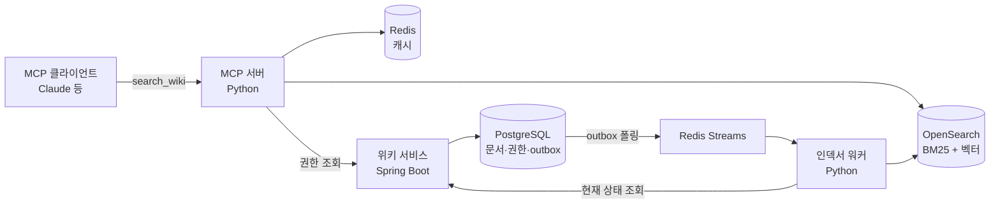
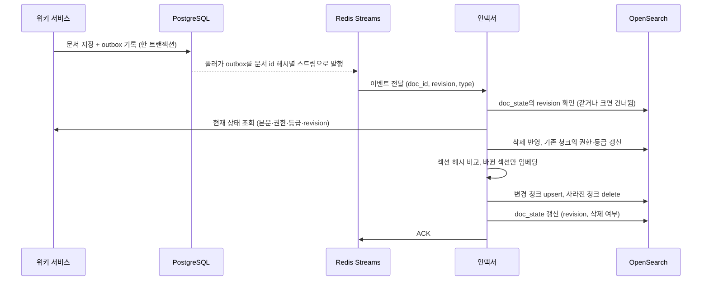

# 사내 위키 RAG MCP 서버 설계서


이 문서는 무엇을 만드는지보다 **왜 그렇게 만드는지**를 기록합니다. 주요 결정마다 고려한 대안, 선택 이유, 감수한 비용, 결정을 다시 볼 조건을 함께 적습니다.

## 0. 설계 제약과 결정 원칙

모든 결정은 아래 제약과 원칙에서 출발합니다. 제약이 바뀌면 결정도 바뀌어야 하므로, 각 결정 기록(ADR)에는 재검토 조건을 둡니다.

### 제약 조건 (가정)

| 제약 | 내용 | 설계에 미친 영향 |
|---|---|---|
| 인원·기간 | 1인, 약 9주 | 운영할 구성 요소 수를 최소화 |
| 데이터 규모 | 문서 수천 개, 청크 수만 개 이하 | 분산 구성 없이 단일 노드로 충분 |
| 비용 | 개인 부담, 월 수만 원 이내 | 로컬 모델 우선, 유료 SaaS 의존 최소화 |
| 데이터 민감도 | 사내 문서를 가정. 답변 생성은 클라이언트의 외부 LLM API가 담당 | 외부로 나가는 데이터를 권한 필터된 조각으로 제한, 데이터를 다루는 외부 업체 추가 최소화 |
| 목적 | 실사용 가능한 서비스 + 설계 역량 증명 | 기술 나열보다 결정 근거와 측정 결과 우선 |

### 결정 원칙

1. **정확성과 보안이 성능보다 먼저**: 권한 누출 0건은 협상 대상이 아닙니다. 지연은 예산 안에서 최적화합니다.
2. **구성 요소는 명확한 이득이 있을 때만 추가**: 하나를 더할 때마다 배포, 장애 지점, 학습 비용이 함께 늘어납니다.
3. **측정한 것만 주장**: 개선은 골든셋 수치로만 말하고, 검증 전 결정은 "실험으로 검증" 상태로 둡니다.
4. **되돌리기 어려운 결정에 시간을 씀**: 권한 모델과 이벤트 구조는 신중하게, 임베딩 모델처럼 교체가 쉬운 것은 빠르게 정하고 실험으로 교정합니다.
5. **프레임워크보다 원리**: 권한 필터와 증분 인덱싱 같은 핵심 로직은 직접 구현해 동작을 설명할 수 있게 합니다.

### 결정 목록

| ID | 결정 | 주요 대안 | 상태 |
|---|---|---|---|
| ADR-01 (2장) | 위키는 Spring, 검색·MCP는 Python으로 분리 | 단일 Python 서비스, Spring AI 단일 서비스 | 확정 |
| ADR-02 (2장) | 검색 저장소로 OpenSearch 사용 | PostgreSQL + pgvector, 벡터 DB + 검색엔진 조합 | 실험으로 검증 |
| ADR-03 (2장) | LangChain 없이 직접 구현 | LangChain, LlamaIndex | 확정 |
| ADR-04 (3장) | MCP 서버는 근거만 반환 | 서버에서 답변까지 생성 | 확정 |
| ADR-05 (3장) | 목적이 겹치지 않는 도구 3개 | 단일 질의응답 도구, 범용 쿼리 도구 | 확정 |
| ADR-06 (3장) | 개발은 stdio, 운영은 HTTP + OAuth | 공용 API 키 인증 | 확정 |
| ADR-07 (4장) | 권한 pre-filter + 본문 조회 시 재확인 | post-filter, 그룹별 인덱스 분리 | 확정 |
| ADR-08 (4장) | 문서 권한은 인덱스에, 그룹 멤버십은 검색 시 해석 | 검색 시 조인, 멤버십까지 인덱스에 저장 | 확정 (권한 필드 구조는 ADR-21로 대체) |
| ADR-09 (5장) | 트랜잭셔널 아웃박스 + Redis Streams | 동기 호출, 이중 쓰기, CDC + Kafka | 확정 (약점 보완은 ADR-19로 대체) |
| ADR-10 (5장) | 섹션 단위 청크 + 해시 기반 증분 반영 | 문서 전체 재색인, 고정 길이 분할 | 확정 |
| ADR-11 (6장) | 로컬 다국어 임베딩 모델 | 상용 임베딩 API | 실험으로 검증 |
| ADR-12 (6장) | 하이브리드 검색을 RRF로 결합 | 벡터 단독, 점수 가중합 | 실험으로 검증 |
| ADR-13 (6장) | 리랭커는 실험 결과에 따라 도입 | 항상 사용, 미사용 | 실험으로 검증 |
| ADR-14 (7장) | 자체 골든셋과 가상 위키로 평가 | 공개 벤치마크, 정성 확인 | 확정 |
| ADR-15 (8장) | OpenTelemetry 기반 관측성 | LangSmith, 로그만 사용 | 확정 |
| ADR-16 (9장) | 모든 도구를 읽기 전용으로 제한 | 문서 작성·수정 도구 제공 | 확정 |
| ADR-17 (4장) | 문서 등급 × 클라이언트 신뢰 등급으로 반환 범위 제어 | 서버에서 로컬 LLM 생성, 기밀 문서 인덱스 제외 | 확정 |
| ADR-18 (5장) | 검색 대상은 위키 원문 문서로 한정 (LLM 종합 페이지 제외) | LLM 종합 위키(Karpathy 패턴), 문서 단위 LLM 요약 | 확정 |
| ADR-19 (5장) | 이벤트 순서는 문서 revision으로 판단하고 상태는 위키에서 다시 읽음 | 권한 변경에도 version 올림, 권한 전용 번호 분리 | 확정 |
| ADR-20 (7장) | 판정은 신뢰구간으로 하고, 보류일 때의 선택을 미리 정함 | 측정값만 기준값과 비교, 기준값 상향, 골든셋 대폭 확대 | 확정 |
| ADR-21 (4장) | 문서 권한은 스페이스 권한과 문서 제한 두 필드로 저장하고, 둘 다 만족해야 반환 | 목록 하나(제한이 스페이스 권한을 대체), 사용자 단위로 풀어 교집합 저장 | 확정 |

"실험으로 검증" 상태인 결정은 7장 실험 결과에 따라 확정하거나 바꾸며, 바뀐 이력도 기록합니다(10장).

## 1. 개요와 목표

사내 위키 문서를 **사용자 권한에 맞게** 검색해, Claude 같은 LLM 에이전트가 MCP 도구로 호출할 수 있게 하는 서버입니다. 목표치는 모두 "왜 이 수치인가"를 함께 적어, 임의로 정한 숫자가 아님을 밝힙니다.

### 해결하려는 문제

- 위키 문서가 많아질수록 필요한 정보를 찾기 어렵고, 에이전트가 사내 지식을 참조할 표준 경로가 없습니다.
- 단순 RAG는 권한 없는 문서까지 검색되거나, 수정된 문서가 한참 뒤에 반영되는 문제가 있습니다. 이 두 가지가 실제 도입을 막는 요인이라 설계의 중심에 둡니다.

### 성공 지표와 목표치의 근거

| 영역 | 지표 | 목표 | 근거 |
|---|---|---|---|
| 권한 | 권한 테스트셋의 무권한 문서 노출 | 0건 | 한 건의 누출도 서비스 신뢰를 무너뜨리므로 유일하게 타협하지 않는 지표 |
| 검색 품질 | Recall@5 (골든셋 중 정답이 있는 270문항) | 0.85 이상 | 상위 5개에 근거가 없으면 클라이언트 LLM이 답할 재료가 없음. 기준선 측정 후 조정할 초기값 |
| 최신성 | 문서 수정 후 검색 반영까지 p95 | 30초 이하 | 수정 직후 동료가 물어도 새 내용이 나오는 수준. 초 단위 실시간은 비용 대비 이득이 없음 |
| 지연 | search 도구 응답 p95 | 800ms 이하 | LLM 답변 생성이 수 초 걸리므로, 검색이 전체 체감 지연의 병목이 되지 않는 선 |
| 안정성 | 동시 50요청 부하 시 오류율 | 1% 미만 | 200명 조직의 업무 시간 최대 동시 사용을 가정한 값 |

### 범위 밖과 그 이유

- **위키 편집기 UI 고도화**: 이 프로젝트의 가치는 검색·권한에 있고, 편집기는 최소 기능이면 충분합니다.
- **임베딩 모델 파인튜닝**: 수천 문서 규모에서는 학습 데이터가 부족하고, 개선 효과를 신뢰성 있게 측정하기 어렵습니다.
- **멀티테넌시**: 단일 조직을 가정합니다. 필요해지면 조직별 인덱스 분리로 확장할 수 있게 권한 필드를 설계합니다.

### 비슷한 시스템과의 비교

권한을 반영한 사내 문서 검색은 이미 여러 곳에서 만들었습니다. 기존 사례를 따른 부분과 이 설계에서 더한 부분을 나누기 위해, 공개 문서로 확인한 범위에서 비교합니다(출처는 11장).

| 항목 | azure-search-openai-demo | Onyx | Amazon Bedrock Knowledge Base | Atlassian 원격 MCP 서버 | 이 설계 |
|---|---|---|---|---|---|
| 형태 | Microsoft 공식 RAG 샘플 앱 | 오픈소스 사내 검색·채팅 | AWS 관리형 서비스 | Atlassian 공식 MCP 서버 | MCP 서버 |
| 답변 생성 | 앱이 Azure OpenAI로 생성 | 제품이 LLM으로 생성 | 근거만 주는 API와 답변까지 만드는 API를 모두 제공 | 도구 결과를 돌려주고, 답은 클라이언트 LLM이 씀 | 근거만 반환 (ADR-04) |
| 권한으로 거르는 방식 | 검색 엔진 안에서 사용자·그룹 필드로 거름 | 문서 ACL로 거르고, 일부 소스는 검색 결과를 받은 뒤 다시 거름 | 검색 전에 거르고, 일부 커넥터는 돌려주기 전에 원본에 다시 확인 | 사용자의 기존 권한을 원본 시스템이 적용 | 검색 전에 거르고, 본문은 위키에 다시 확인 (ADR-07, ADR-21) |
| 그룹 멤버십 | 질의할 때 Microsoft Graph로 해석 | 동기화해 둔 그룹을 질의할 때 읽음 | 수집 때 모아 둔 멤버십과 질의할 때 대조 | 원본 시스템이 판단 | 질의할 때 위키에서 조회 (ADR-08) |
| 권한 평가에 실패하면 | Azure AI Search가 5xx를 돌려주고 일부만 거른 결과는 주지 않음 | 공개 문서에서 확인하지 못함 | 해당 문서를 돌려주지 않음 | 공개 문서에서 확인하지 못함 | 오류를 돌려줌 (ADR-08) |

문서마다 권한을 두고 검색 결과를 권한으로 거르는 것, 그룹 멤버십을 청크에 넣지 않고 따로 해석하는 것, 권한 평가에 실패하면 결과를 주지 않는 것은 공개된 사례들과 같은 방향입니다. 이 설계에서 더한 것은 세 가지입니다.

- 결과를 MCP 도구로 내보내 어느 MCP 클라이언트에서든 쓰게 하고, 서버는 답변을 만들지 않습니다(ADR-04, ADR-05).
- 사용자 권한에 클라이언트 신뢰 등급을 더해, 같은 사용자라도 외부 LLM 클라이언트에는 기밀 문서의 본문을 주지 않습니다(ADR-17).
- 검색 구성은 실험 전에 정한 기준과 신뢰구간으로 판정합니다(ADR-20).

Atlassian 원격 MCP 서버는 같은 MCP 서버지만 작업 항목과 페이지를 만들고 고치는 도구가 있습니다. 이 설계는 위키 본문을 통한 인젝션이 쓰기로 이어지지 않도록 도구를 읽기 전용으로 둡니다(ADR-16).

## 2. 전체 아키텍처

위키 본체는 Spring, 검색과 MCP는 Python으로 분리하고, 검색 저장소는 OpenSearch 하나로 둡니다. 쓰기 경로와 읽기 경로를 분리해 인덱싱 지연이 검색 응답에 영향을 주지 않게 합니다.



### 구성 요소와 존재 이유

| 구성 요소 | 기술 | 역할 | 없으면 생기는 문제 |
|---|---|---|---|
| 위키 서비스 | Spring Boot, JPA, PostgreSQL | 문서·버전·권한의 원천, outbox 기록 | 권한 판단 기준이 여러 곳에 흩어짐 |
| 인덱서 워커 | Python | 이벤트 소비, 청크 분할, 임베딩 | 위키 저장 요청이 임베딩 시간만큼 느려짐 |
| MCP 서버 | Python MCP SDK, FastAPI | 도구 제공, 검색, 권한 필터 | 에이전트가 사내 지식에 접근할 표준 경로가 없음 |
| 검색 저장소 | OpenSearch (nori + k-NN) | 키워드·벡터 검색과 권한 필터 | 약어·에러 코드 같은 정확 일치 검색 품질 저하 |
| Redis | Redis, Redis Streams | 권한·임베딩 캐시, 인덱싱 이벤트 전달 | 캐시와 메시징에 구성 요소가 하나씩 더 필요 |

Redis 하나로 캐시와 메시징을 함께 처리하는 것은 원칙 2(구성 요소 최소화)에 따른 선택입니다.

### ADR-01. 위키와 검색·MCP를 서로 다른 서비스로 분리

권한과 문서의 원천은 위키이고, 검색은 임베딩·리랭커 같은 ML 생태계에 의존합니다.

| 선택지 | 장점 | 단점 |
|---|---|---|
| 단일 Python 서비스 | 배포 1개로 단순 | 문서 CRUD·권한·트랜잭션을 새로 구성, 실무의 자바 중심 백엔드와 거리 |
| Spring AI 단일 서비스 | 자바 하나로 통일 | 한국어 임베딩·리랭커 모델을 로컬에서 돌리는 생태계가 Python보다 얕음 |
| **Spring 위키 + Python 검색 (선택)** | 책임 분리, 각 언어의 강점 활용 | 서비스 2개, 서비스 간 호출 1회 추가 |

- **결정 이유**: 권한의 원천(위키)과 검색 인덱스를 분리하면, 검색 쪽에 문제가 생겨도 문서 본문의 최종 권한 판단은 위키가 유지합니다(ADR-07의 재확인과 연결). 자바 메인 서비스와 파이썬 AI 서버의 조합이 실무에서 흔하다는 점, 두 스택을 모두 증명하려는 목적도 있음을 숨기지 않습니다.
- **감수한 비용**: 배포 단위 2개, 권한 조회 네트워크 호출. 호출 비용은 Redis 캐시로 줄입니다.
- **재검토 조건**: 팀 언어가 자바뿐이고 로컬 모델이 필요 없다면 Spring AI 단일 서비스로 합칩니다.
- **참고**: [Spring AI MCP](https://docs.spring.io/spring-ai/reference/api/mcp/mcp-overview.html)로 Spring에서도 MCP 서버를 만들 수 있고, [Spring AI ONNX 임베딩](https://docs.spring.io/spring-ai/reference/api/embeddings/onnx.html)은 Python 도구로 ONNX 형식으로 바꾼 모델을 불러 씁니다. 임베딩 모델과 리랭커(cross-encoder)를 그대로 쓸 수 있는 쪽은 Python의 [Sentence Transformers](https://sbert.net/)입니다.

### ADR-02. 검색 저장소로 OpenSearch 사용

사내 위키 질문은 약어, 에러 코드, 서비스명처럼 정확히 일치해야 하는 단어가 많아, 한국어 키워드 검색 품질이 핵심 요구입니다.

| 선택지 | 장점 | 단점 |
|---|---|---|
| PostgreSQL + pgvector | 저장소 1개, 문서와 같은 DB | 기본 전문 검색에 한국어 형태소 분석기가 없어 확장 설치와 검증이 필요 |
| **OpenSearch (선택)** | nori 형태소 분석, 벡터 검색, 권한 필터를 한 쿼리로 처리 | 구성 요소 1개 추가, 메모리 사용량 큼 |
| 벡터 DB + 검색 엔진 조합 | 각 영역 최적 | 동기화 대상 2개, 권한 필터를 두 곳에 구현해야 함 |

- **결정 이유**: 권한 필터를 키워드와 벡터 검색에 같은 조건으로 한 번에 적용할 수 있어, 필터 누락 위험이 가장 낮습니다.
- **감수한 비용**: 원칙 2와 충돌하는 결정이라는 점을 인정합니다. 그래서 가설로 두고 실험으로 판정합니다.
- **재검토 조건**: 7장 실험에서 하이브리드 검색이 벡터 단독 대비 Recall@5를 2%p 미만으로만 올리면, 키워드 검색의 가치가 운영 비용을 정당화하지 못한 것으로 보고 PostgreSQL + pgvector로 단순화합니다. 판정 방법은 실험 전에 정한 ADR-20을 따르며, 판정이 보류로 나와도 단순화합니다. 이 규칙에서는 300문항 기준으로 측정한 차이가 약 4~5%p는 되어야 OpenSearch를 유지합니다(ADR-20 감수한 비용).
- **단순화할 때**: 검색 인덱스는 위키 DB와 분리된 PostgreSQL 데이터베이스에 둡니다(ADR-01). 키워드 검색은 두지 않고 벡터 검색만 씁니다. 보류는 효과를 증명하지 못한 것이고, 원칙 2에 따라 증명되지 않은 구성은 늘리지 않습니다. BEIR처럼 BM25가 강한 기준선이라는 외부 근거가 있어도 이 위키의 골든셋 측정을 우선합니다. 두 권한 필드(ADR-21)는 WHERE 절로 겁니다. pgvector의 근사 인덱스는 필터를 인덱스 스캔 뒤에 적용하므로 iterative scan(0.8.0 이상)을 켜되, 이 방식도 `hnsw.max_scan_tuples`에서 멈춰 k개를 보장하지 않습니다. 그래서 4장의 "결과 수" 검증을 그대로 적용하고, 모자라면 이 값을 올리거나 정확 검색으로 바꿉니다. 옮긴 뒤에는 같은 골든셋으로 다시 측정해 기록합니다. OpenSearch 벡터 검색보다 확실히 낮으면(차이의 신뢰구간 상한이 0보다 작으면) 검색 설정을 조정하고, 그래도 낮으면 OpenSearch의 벡터 검색만 남깁니다. 이 작업은 판정 직후, M3에 들어가기 전에 합니다.
- **참고**: [pgvector](https://github.com/pgvector/pgvector)는 근사 인덱스에서 필터를 인덱스 스캔 뒤에 적용하고, 0.8.0부터 iterative scan으로 더 스캔하지만 스캔 상한이 있습니다. 한국어 형태소 분석은 [nori](https://www.elastic.co/docs/reference/elasticsearch/plugins/analysis-nori)입니다.

### ADR-03. LangChain 없이 직접 구현

| 선택지 | 장점 | 단점 |
|---|---|---|
| LangChain, LlamaIndex | 문서 로더·분할기·체인을 바로 사용, 채용 공고 키워드 | 권한 필터가 쿼리에 어떻게 들어가는지 같은 핵심 동작이 추상화 뒤에 숨음, 잦은 버전 변화 |
| **직접 구현 (선택)** | 모든 동작을 설명 가능, 의존성 최소 | 로더와 분할기를 직접 작성 |

- **결정 이유**: 이 서버의 가치는 검색 파이프라인의 세부 제어에 있고, 그 부분이 곧 면접에서 설명할 내용입니다(원칙 5).
- **절충**: 서버를 호출하는 데모 에이전트는 LangGraph로 만들 수 있습니다. 서버 설계와 독립적인 영역이라 원칙과 충돌하지 않습니다.
- **재검토 조건**: 연동할 데이터 소스가 여러 종류로 늘면, 로더 계층에 한해 라이브러리를 도입합니다.
- **참고**: [Anthropic, Building effective agents](https://www.anthropic.com/engineering/building-effective-agents) (LLM API를 직접 쓰는 것부터 시작하고, 프레임워크를 쓴다면 내부 동작을 이해하라고 권고)

## 3. MCP 인터페이스 설계

서버는 답변을 생성하지 않고 **근거만 반환**하며, 목적이 겹치지 않는 도구 3개를 제공합니다. 모든 도구는 읽기 전용입니다(ADR-16).

### 도구 (Tools)

| 도구 | 입력 | 출력 | 용도 |
|---|---|---|---|
| `search_wiki` | query, space(선택), top_k(기본 5), updated_after(선택) | 청크 목록: doc_id, title, section, snippet, url, version, updated_at, score | 질문과 관련된 근거 검색 |
| `get_document` | doc_id, section(선택) | 문서 본문, 버전, 최종 수정일 | 검색 결과의 전체 맥락 확인 |
| `list_recent_changes` | since, space(선택) | 변경 문서 목록 | "이번 주 바뀐 정책" 같은 최신성 질문 |

문서는 `wiki://doc/{doc_id}` 리소스로도 노출해, 클라이언트가 도구 호출 없이 특정 문서를 참조할 수 있게 합니다. 리소스도 `get_document`와 같은 경로로 위키에서 권한을 재확인하고 등급 정책(ADR-17)을 적용합니다. 리소스는 템플릿으로만 노출하고 목록(`resources/list`)으로 문서를 나열하지 않으며, `get_document`와 리소스 모두 권한 없는 doc_id와 없는 doc_id에 같은 응답을 돌려줍니다.

### 세부 설계와 이유

- **도구 설명이 곧 프롬프트**: LLM은 설명문을 읽고 도구를 고르므로, 언제 쓰고 언제 쓰지 말아야 하는지를 설명에 명시합니다.
- **스니펫 800자, 응답 약 4천 토큰 상한**: 클라이언트의 컨텍스트는 대화 전체가 나눠 쓰는 자원이라, 검색 결과가 이를 독점하지 않게 합니다.
- **모든 결과에 url과 version 포함**: 답변 출처를 표기하고, 문서가 바뀐 뒤에도 어떤 버전을 근거로 했는지 추적하기 위함입니다.
- **도구에 읽기 전용 표시**: 도구 3개에 MCP 도구 annotation `readOnlyHint: true`와 `openWorldHint: false`를 붙여 클라이언트가 도구의 성격을 알 수 있게 합니다. 도구가 사내 위키만 다루므로 openWorldHint는 false입니다. 다만 MCP 명세는 신뢰할 수 있는 서버가 아니면 클라이언트가 annotation을 신뢰하지 말라고 하므로, 실제 보장은 쓰기 경로가 아예 없는 서버 설계(ADR-16)입니다.

### ADR-04. MCP 서버는 근거만 반환

| 선택지 | 장점 | 단점 |
|---|---|---|
| 서버가 답변까지 생성 | 서버 단독으로 완결된 데모 | 클라이언트 LLM과 생성이 중복되어 비용·지연 두 배, 서버에 LLM 키와 프롬프트 관리 부담 |
| **근거만 반환 (선택)** | 생성은 클라이언트가, 서버는 검색 품질에만 집중 | 답변 품질이 클라이언트 모델에 좌우 |

- **결정 이유**: MCP 클라이언트는 이미 LLM이므로 생성을 중복할 이유가 없습니다. 서버의 책임이 "무엇을 근거로 줬는가"로 좁혀져, 품질도 검색 지표만으로 평가할 수 있습니다.
- **감수한 비용**: 서버 단독 시연이 밋밋해, 데모 에이전트로 보완합니다.
- **재검토 조건**: 슬랙 봇처럼 MCP를 쓰지 않는 채널을 지원해야 하면, 답변 생성 API를 별도로 추가합니다.
- **참고**: [Amazon Bedrock Retrieve API](https://docs.aws.amazon.com/bedrock/latest/APIReference/API_agent-runtime_Retrieve.html)는 근거만 돌려주고, [RetrieveAndGenerate API](https://docs.aws.amazon.com/bedrock/latest/APIReference/API_agent-runtime_RetrieveAndGenerate.html)는 답변까지 만듭니다. 이 설계는 앞쪽만 제공합니다.

### ADR-05. 목적이 겹치지 않는 도구 3개

| 선택지 | 장점 | 단점 |
|---|---|---|
| 단일 질의응답 도구 (`ask_wiki`) | 호출이 단순 | ADR-04와 충돌, 목록 요청과 질문을 구분할 수 없음 |
| 범용 쿼리 도구 (필터 자유 입력) | 유연함 | LLM이 잘못된 필터를 만들 여지, 권한 필터를 우회하려는 입력 표면이 넓어짐 |
| **목적별 도구 3개 (선택)** | 도구 선택 오류가 적고 입력 검증이 쉬움 | 새 질문 유형이 생기면 도구 추가 필요 |

- **결정 이유**: 도구 수가 적고 목적이 겹치지 않을수록 LLM의 도구 선택이 정확해집니다. "최근 변경"처럼 자주 나오는 질문은 전용 파라미터로 구조화합니다.
- **검증 방법**: 골든셋 질문을 클라이언트에 입력해, 의도한 도구를 고른 비율(도구 선택 정확도)을 측정합니다.
- **재검토 조건**: 도구 선택 오류가 10%를 넘으면 설명문을 고치고, 그래도 개선되지 않으면 도구를 통합합니다.
- **참고**: [MCP 명세: 도구](https://modelcontextprotocol.io/specification/2026-07-28/server/tools)

### ADR-06. 개발은 stdio, 운영은 HTTP + OAuth

- **선택지**: 공용 API 키 인증, OAuth 기반 사용자 인증(선택).
- **결정 이유**: 권한 필터(ADR-07)는 "요청한 사람이 누구인가"를 전제로 합니다. 공용 API 키로는 사용자를 구분할 수 없어 권한 설계 전체가 무의미해집니다. 로컬 개발은 설정이 필요 없는 stdio로 빠르게 반복합니다.
- **추가 결정**: 클라이언트 토큰을 위키 서비스에 그대로 넘기지 않습니다. 토큰이 원래 대상이 아닌 서비스에서 재사용되는 위험을 막기 위해, 서버 간 호출은 별도 서비스 자격 증명을 씁니다.
- **감수한 비용**: OAuth 연동 구현과 테스트 부담.
- **참고**: [MCP 명세: 권한 부여](https://modelcontextprotocol.io/specification/2026-07-28/basic/authorization) (HTTP 전송은 OAuth 2.1, stdio는 실행 환경의 자격 증명), [MCP 보안 모범 사례](https://modelcontextprotocol.io/docs/2026-07-28/tutorials/security/security_best_practices) (클라이언트 토큰을 그대로 넘기지 않음)

### 사용 시나리오

사용자는 MCP 클라이언트(Claude 등)에 자연어로 요청하고, 클라이언트가 도구를 골라 호출합니다. 서버는 두 경우 모두 같은 형태의 근거 목록을 반환하며, 응답 형태는 클라이언트가 요청 의도에 맞춰 정합니다.

| 요청 유형 | 사용자 요청 예시 | 도구 호출 | 클라이언트 응답 |
|---|---|---|---|
| 문서 찾기 | 해외 출장비 정산 관련 문서 있으면 줘 | `search_wiki("해외 출장비 정산")` | 문서 후보 목록: 제목, 스페이스, 수정일, 버전, 스니펫 |
| 질문하기 | 출장 영수증 언제까지 올려야 해? | `search_wiki("출장 영수증 제출 기한")` | 근거를 요약한 답변 + 문서·섹션·버전 출처 |
| 이어서 보기 | 첫 번째 문서 전체 보여줘 | `get_document(doc_id)` | 문서 본문 (위키 서비스에서 권한 재확인 후) |

화면에 드러나는 설계 원칙은 다음과 같습니다.

- **권한 없는 문서는 흔적을 남기지 않습니다.** "권한 없는 문서 N건 제외" 같은 안내도 하지 않습니다. 문서의 존재 자체가 정보가 될 수 있기 때문입니다.
- 1년 이상 수정되지 않은 문서에는 "오래된 문서" 표시를 붙입니다(6장).
- 출처에 문서 버전을 포함해, 문서가 바뀐 뒤에도 답변 당시 어떤 버전을 근거로 했는지 추적할 수 있습니다.

## 4. 권한 반영 검색

권한 필터는 검색 **전에** 적용하고, 문서 본문을 줄 때 위키에서 한 번 더 확인합니다. 원칙 1에 따라 이 장의 결정은 성능보다 누출 방지를 우선합니다.

### 권한 모델

- 문서는 하나의 스페이스(팀·부서 공간)에 속하고, 기본 권한은 스페이스에서 상속됩니다.
- 일부 문서는 "제한 문서"로 지정해 별도의 허용 대상을 둡니다. 제한 문서는 스페이스 보기 권한과 제한 목록을 둘 다 만족해야 볼 수 있습니다(ADR-21). 실제 위키 도구(Confluence 등)의 일반적인 권한 구조를 따른 것입니다.
- 권한 판단 단위(principal)는 `user:{id}`, `group:{id}` 두 종류이고, 전체 공개는 특수값 `all`로 표시합니다.
- 권한 필드(`space_principals`, `restricted_principals`)가 비어 있으면 공개가 아니라 아무도 볼 수 없는 문서로 다룹니다. 공개에는 반드시 `all`을 적습니다. 권한 정보가 빠진 채 색인된 문서가 전체 공개로 새지 않게 하기 위해서입니다. azure-search-openai-demo도 설정에 따라 권한이 비어 있는 문서를 전체 공개로 보던 이전 방식을 바꿔, 공개 문서마다 `["all"]`을 적도록 요구합니다(11장).

### ADR-07. 권한 pre-filter + 본문 조회 시 재확인

| 선택지 | 장점 | 단점 |
|---|---|---|
| 검색 후 거르기 (post-filter) | 구현이 가장 단순 | 상위 5개를 먼저 뽑고 거르면 제한 문서가 많은 사용자는 결과가 0~1개만 남음. 거르기 전 결과가 로그·캐시·리랭커 입력에 남을 수 있음 |
| 그룹별 인덱스 분리 | 물리적으로 격리 | 여러 그룹이 보는 문서가 중복 저장, 권한 변경 시 대량 재색인 |
| 검색 후 위키 API로 건별 확인 | 항상 최신 권한 | 후보 30개마다 API 호출로 지연 급증, 결과 부족 문제는 post-filter와 동일 |
| **pre-filter + 본문 재확인 (선택)** | 결과 수 보장, 중간 단계 누출 차단 | 인덱스의 권한이 원본과 잠시 어긋날 수 있음 |

- **남는 위험 (명시적 인정)**: 권한이 회수된 직후, 인덱스 반영 전까지 짧은 시간 동안 **스니펫**이 노출될 수 있습니다. 본문은 `get_document`의 재확인으로 차단되고, 이 틈은 ACL_CHANGED 이벤트로 줄여 목표 p95 30초 이내로 관리합니다.
- **재검토 조건**: 권한 변경의 즉시 반영이 규정상 요구되는 환경이라면, 검색 결과의 스니펫도 위키 API로 재확인하고 늘어나는 지연을 감수합니다.
- **참고**: [azure-search-openai-demo](https://github.com/Azure-Samples/azure-search-openai-demo/blob/main/docs/login_and_acl.md)와 [Amazon Bedrock Knowledge Base](https://docs.aws.amazon.com/bedrock/latest/userguide/kb-managed-acl.html)는 검색 엔진 안에서 거릅니다. [Azure AI Search 벡터 필터](https://learn.microsoft.com/en-us/azure/search/vector-search-filters)는 postFilter가 결과를 놓칠 수 있다고 설명하고, [OWASP LLM08](https://genai.owasp.org/llmrisk/llm082025-vector-and-embedding-weaknesses/)은 권한을 반영하는 벡터 저장소와 데이터셋의 분리를 권고하는데, 이 설계는 인덱스를 나누지 않고 권한 필터로 분리합니다. Bedrock은 Confluence 같은 일부 커넥터에서 돌려줄 문서마다 원본에 권한을 다시 확인해 동기화 사이의 권한 변경을 잡는데, 이 ADR의 재검토 조건에 적은 방식입니다. 반대 사례로 [Onyx](https://github.com/onyx-dot-app/onyx/blob/main/backend/ee/onyx/external_permissions/post_query_censoring.py)는 일부 소스를 검색이 끝난 뒤에 거릅니다.

### ADR-08. 문서 권한은 인덱스에, 그룹 멤버십은 검색 시 해석

각 청크에는 문서 권한만 `allowed_principals`로 비정규화해 저장합니다. "누가 어느 그룹에 속하는가"는 인덱스에 넣지 않고 검색 시점에 해석합니다.

- **결정 이유**: 입사, 퇴사, 팀 이동 같은 멤버십 변경은 문서 권한 변경보다 훨씬 잦습니다. 멤버십까지 인덱스에 넣으면 한 사람의 팀 이동만으로 수천 개 청크를 갱신해야 합니다.
- **감수한 비용**: 검색마다 사용자의 그룹 목록을 위키에서 조회해야 합니다. Redis에 60초 캐시하고, 멤버십 변경 이벤트가 오면 즉시 무효화합니다.
- **조회 실패 시**: 캐시에 없고 위키 조회도 실패하면, 사용자 id만으로 검색하지 않고 오류를 돌려줍니다. 권한이 덜 반영된 결과는 누출은 아니지만, 사용자가 문서가 없다고 잘못 믿게 됩니다. Azure AI Search도 권한 평가에 실패하면 일부만 거른 결과 대신 5xx를 돌려줍니다(11장). 이 오류는 질의나 doc_id와 관계없이 같은 형태로 돌려줍니다. `get_document`와 리소스가 위키에 묻기 전에 인덱스로 존재 여부를 먼저 확인하면, 장애 중에 "없음"과 "오류"가 갈려 문서의 존재가 드러나기 때문입니다.
- **재검토 조건**: 사용자당 소속 그룹이 수백 개로 늘어 필터 조건이 커지면, 그룹 계층을 평탄화하거나 조직 단위 필터를 추가합니다.
- **참고**: [Azure AI Search 보안 필터](https://learn.microsoft.com/en-us/azure/search/search-security-trimming-for-azure-search) (문서에 그룹 id 필드), [Azure AI Search 질의 시점 접근 제어](https://learn.microsoft.com/en-us/azure/search/search-query-access-control-rbac-enforcement) (그룹을 질의할 때 해석)

### ADR-21. 문서 권한은 스페이스 권한과 문서 제한 두 필드로 저장하고, 둘 다 만족해야 반환

ADR-08의 `allowed_principals` 목록 하나를 대체합니다. 이 설계가 기준으로 삼은 Confluence는 스페이스 보기 권한이 있어도 문서 제한에 들지 않으면 볼 수 없고, 반대로 제한 대상이라도 스페이스 보기 권한이 없으면 볼 수 없습니다. 목록 하나는 "목록 중 하나에 속하면 허용"이라, "그룹 A에 속하면서 그룹 B에도 속함"을 표현할 수 없습니다. 그대로 두면 제한 대상이지만 스페이스 멤버가 아닌 사용자에게 스니펫이 나갑니다. 본문은 ADR-07의 재확인이 막지만 스니펫은 막지 못합니다.

| 선택지 | 장점 | 단점 |
|---|---|---|
| 목록 하나를 두고, 제한 문서는 제한 목록이 스페이스 권한을 대체 | 필드와 필터가 가장 단순 | Confluence와 의미가 달라짐. 제한 목록에 스페이스 밖 사람을 넣으면 그 사람도 보게 되고, 위키와 인덱스가 같은 규칙을 따르는지 따로 보장해야 함 |
| 그룹을 사용자 단위로 풀어 두 층의 교집합을 저장 | 필드 하나로 정확한 권한 | 그룹 멤버십을 인덱스에 넣는 것과 같아 ADR-08과 충돌, 팀 이동마다 재색인 |
| **스페이스 권한과 문서 제한을 필드 두 개로 저장하고 둘 다 만족해야 반환 (선택)** | Confluence와 같은 의미, 멤버십은 여전히 검색 시 해석(ADR-08) | 필드와 필터 조건이 하나씩 늘어남 |

- **결정**:
  - 청크에 `space_principals`(스페이스 보기 권한)와 `restricted_principals`(문서 제한)를 저장합니다.
  - 검색 필터는 두 필드 각각에 "사용자의 principal 중 하나라도 포함"을 걸고, 두 조건을 AND로 묶어 knn 절 안의 `filter`에 둡니다(4장 "벡터 검색의 필터 적용 방식").
  - 제한이 없는 문서는 `restricted_principals`에, 전체 공개 스페이스는 `space_principals`에 `all`을 넣습니다. 어느 필드든 비어 있으면 아무도 볼 수 없습니다(4장 "권한 모델").
  - 위키(M3)도 같은 의미로 구현하고, `get_document`와 리소스의 재확인은 위키가 두 층을 모두 따져 판단합니다.
- **결정 이유**:
  - 문서 하나의 권한은 층이 스페이스와 문서 제한 둘로 정해져 있어 필드 두 개로 정확히 표현됩니다. 여러 문서를 합친 종합 페이지는 합친 문서 수만큼 층이 늘어 정해진 필드로 표현할 수 없는데, 이 차이가 ADR-18에서 종합 페이지를 받지 않은 이유이기도 합니다.
  - 두 층을 제대로 합치지 않으면 실제로 누출이 생깁니다. Elastic의 Confluence 커넥터가 상속된 보기 제한을 무시하고 스페이스 권한으로 넓게 허용한 버그가 알려진 이슈로 올라 있습니다(11장).
- **감수한 비용**: 필드와 필터 조건이 하나씩 늘어납니다. 스페이스 권한이 바뀌면 그 스페이스 모든 청크의 `space_principals`를 고쳐야 하는데, 이는 4장 "권한 변경 전파"의 스페이스 권한 변경 경로(문서마다 revision을 올리고 ACL_CHANGED 발행)로 처리됩니다.
- **검증 방법**: 권한 테스트셋에 두 방향을 모두 넣습니다. 스페이스 멤버이지만 제한 대상이 아닌 사용자와, 제한 대상이지만 스페이스 멤버가 아닌 사용자 모두에게 제한 문서가 나오면 안 됩니다.
- **재검토 조건**: 페이지 계층과 조상 페이지 제한의 상속을 도입하면 층 수가 문서마다 달라져 필드 두 개로 표현할 수 없습니다. 그때 다시 결정합니다.
- **참고**: [Confluence 권한과 제한](https://support.atlassian.com/confluence-cloud/docs/what-are-confluence-cloud-permissions-and-restrictions/) (스페이스 보기 권한이 있어도 제한에 들지 않으면 볼 수 없음), [Elastic 커넥터 알려진 이슈](https://www.elastic.co/docs/reference/search-connectors/es-connectors-known-issues)

### ADR-17. 문서 등급 × 클라이언트 신뢰 등급으로 반환 범위 제어

답변 생성은 클라이언트의 LLM이 하므로(ADR-04), 기밀 문서를 사내 LLM으로 보내라고 서버가 **라우팅할 방법은 없습니다.** 서버가 통제할 수 있는 것은 "어떤 클라이언트에게 무엇을 돌려줄지"뿐이라, 권한을 **누가(사용자 권한)** 와 **어디로(클라이언트 신뢰 등급)** 두 축으로 확장합니다.

| 선택지 | 장점 | 단점 |
|---|---|---|
| 서버에서 기밀 문서만 로컬 LLM으로 생성 | 기밀 본문이 외부로 나가지 않음 | ADR-04와 충돌, 서버가 LLM을 운영해야 함 |
| 기밀 문서를 인덱스에서 제외 | 가장 단순하고 안전 | 사내 LLM 경로에서도 검색 불가, 위키 가치 감소 |
| **등급 기반 반환 범위 제어 (선택)** | ADR-04 유지, 경로별로 다른 범위 제공 | 등급 관리와 클라이언트 등록 부담 |

| 문서 등급 | 외부 LLM 클라이언트 | 사내 LLM 클라이언트 |
|---|---|---|
| 일반 | 스니펫·본문 | 스니펫·본문 |
| 기밀 | 제목·링크만 | 스니펫·본문 |

- **기밀 문서를 숨기지 않고 제목·링크를 주는 이유**: 요청한 사용자는 이미 볼 권한이 있습니다. 막아야 할 대상은 사용자가 아니라 외부 LLM으로 본문이 흘러가는 경로이고, 사용자는 링크로 위키에서 직접 읽으면 됩니다.
- **메타데이터**: 청크에 `classification`(일반·기밀)을 권한처럼 비정규화해 저장합니다. 스페이스 기본값을 상속하고 문서별로 올릴 수 있으며, 9장의 민감정보 탐지가 등급 상향을 제안할 수 있습니다.
- **클라이언트 등급은 서버가 판단**: 등급은 인증된 OAuth 클라이언트 id로 서버가 결정합니다. 요청 파라미터로 받으면 외부 클라이언트가 스스로 등급을 올릴 수 있기 때문입니다.
- **목표**: 외부 LLM 클라이언트로 기밀 문서의 스니펫·본문 반환 0건.
- **범위 조절**: 필드와 반환 정책까지 구현하고, 등급이 다른 OAuth 클라이언트 두 개로 정책을 테스트합니다. 실제 사내 LLM 에이전트 연결은 폐쇄망 확장(ADR-11)과 묶어 선택 과제로 둡니다.
- **참고**: [Amazon Bedrock Knowledge Base](https://docs.aws.amazon.com/bedrock/latest/userguide/kb-managed-acl.html) (ACL 필터는 인증을 대신하지 않음), [Azure AI Search 민감도 라벨](https://learn.microsoft.com/en-us/azure/search/search-query-sensitivity-labels) (등급을 질의 시점에 판정), [MCP 보안 모범 사례](https://modelcontextprotocol.io/docs/2026-07-28/tutorials/security/security_best_practices) (confused deputy)

### 권한 변경 전파

| 변경 유형 | 처리 방식 | 재임베딩 |
|---|---|---|
| 문서 권한 변경 | 문서 revision을 올리고 ACL_CHANGED 발행. 인덱서가 해당 문서 청크의 권한 필드만 갱신 | 불필요 |
| 문서 등급 변경 | ACL_CHANGED와 같은 경로로 `classification` 필드만 부분 업데이트 | 불필요 |
| 그룹 멤버십 변경 | 인덱스 변경 없음. 캐시 무효화로 다음 검색부터 반영 | 불필요 |
| 스페이스 권한 변경 | 스페이스 안 문서마다 revision을 올리고 ACL_CHANGED를 일괄 발행 | 불필요 |
| 스페이스 기본 등급 변경 | 스페이스 권한 변경과 같은 경로 | 불필요 |

권한 변경에 재임베딩이 필요 없도록 권한 필드와 임베딩을 분리한 것이 이 표의 핵심입니다.

### 벡터 검색의 필터 적용 방식

OpenSearch k-NN에서 필터를 검색 도중에 적용하는 efficient filtering은 lucene·faiss 엔진에서, 필터를 **knn 절 안의 `filter`**에 둘 때만 작동합니다. knn 쿼리를 `bool`로 감싸 `filter` 절에 두거나 `post_filter`에 두면 엔진과 관계없이 post-filter로 처리되어, ADR-07이 기각한 결과 부족 문제가 조용히 생깁니다. faiss의 `index.knn.faiss.efficient_filter.disable_exact_search`는 기본값(false)으로 둡니다. true로 바꾸면 조건에 맞는 문서가 k개 이상이어도 k개보다 적게 돌려줄 수 있습니다. 그래서 M1 인덱스 매핑에서 엔진을 명시하고, 검색 코드는 필터를 knn 절 안에 둡니다. knn 절 안의 `filter`에 `bool`로 두 권한 조건(ADR-21)을 묶는 것은 괜찮습니다. post-filter가 되는 것은 knn 절 바깥을 `bool`로 감쌀 때입니다.

### 검증 방법

- 권한 테스트셋: 권한이 다른 가상 사용자 5명 × 제한 문서 조합으로, 검색 결과에 무권한 문서가 하나라도 나오면 CI가 실패합니다. 아래 경우를 반드시 넣습니다. Elastic의 Confluence 커넥터에는 상속된 보기 제한을 무시하고 스페이스 권한으로 넓게 허용한 버그가 알려진 이슈로 올라 있습니다(11장).
  - 스페이스 멤버이지만 제한 대상이 아닌 사용자, 제한 대상이지만 스페이스 멤버가 아닌 사용자(ADR-21)
  - 권한 필드가 비어 있는 문서
  - 그룹 조회가 실패하는 경우. 결과가 줄어드는 것으로는 부족하고 응답이 오류여야 통과합니다(ADR-08).
  - 위키 장애 중에 있는 doc_id와 없는 doc_id로 `get_document`와 리소스를 호출해 같은 응답이 오는지
- 등급 테스트셋: 외부·사내 등급 클라이언트 2개 × 기밀 문서 조합으로, 외부 클라이언트에 기밀 스니펫·본문이 하나라도 나가면 CI가 실패합니다.
- 적용 범위: 두 테스트셋은 도구 3개(`search_wiki`, `get_document`, `list_recent_changes`)와 문서 리소스(`wiki://doc/{doc_id}`)에 모두 적용하고, 목록·스니펫·본문 어디에든 나오면 실패로 봅니다. 리소스는 ADR-05의 도구 수에 잡히지 않지만, 문서에 닿는 경로라는 점은 같습니다.
- 결과 수: 제한 문서가 많은 사용자도, 볼 수 있는 청크가 k개 이상이면 k개를 받는지 확인합니다("벡터 검색의 필터 적용 방식").
- 권한 회수: 문서 권한을 회수한 뒤 인덱스 반영 목표(30초) 안에 검색 결과에서 사라지는지 확인합니다. 결과 캐시를 도입하면(8장) 같은 사용자·같은 질의로 캐시를 먼저 채운 뒤 회수하고, 세대 번호가 오른 직후 다시 검색해 옛 결과가 나오지 않는지도 확인합니다.
- 토큰 없이 검색, 사용자 토큰으로 검색, 필터를 끈 관리자 검색 세 결과를 비교해 필터가 실제로 작동하는지 확인합니다.

## 5. 인덱싱 파이프라인과 최신성

문서 변경은 트랜잭셔널 아웃박스로 유실 없이 전달하고, 인덱서는 **바뀐 섹션만** 다시 임베딩합니다. 이 장의 요구는 처리량이 아니라 "유실 없음"과 "불필요한 재임베딩 없음"입니다.



### ADR-09. 트랜잭셔널 아웃박스 + Redis Streams

| 선택지 | 장점 | 단점 |
|---|---|---|
| 저장 시 인덱서 동기 호출 | 즉시 반영, 단순 | 인덱서 장애가 위키 저장 실패로 번짐. 저장 후 호출이 실패하면 변경 유실 |
| 저장 후 메시지 발행 (이중 쓰기) | 비동기 | DB 커밋과 발행 사이에 장애가 나면 유실·불일치 |
| CDC(Debezium) + Kafka | 대규모에 표준적 | 구성 요소 3개 이상 추가, 1인 운영에 과함 |
| **아웃박스 + Redis Streams (선택)** | 유실 없음, 캐시용 Redis 재사용 | 폴링 지연(약 1초), 스트림 순서 보장이 제한적 |

- **결정 이유**: 문서 저장과 이벤트 기록을 같은 트랜잭션으로 묶으면 "문서는 바뀌었는데 이벤트는 없는" 상태가 원천적으로 불가능합니다. Redis는 캐시로 이미 필요하므로 구성 요소가 늘지 않습니다.
- **약점 보완**: 중복 전달은 (doc_id, version) 키로 멱등 처리하고, 순서 뒤바뀜은 인덱스에 저장된 버전보다 오래된 이벤트를 버리는 방식으로 막습니다.
- **재검토 조건**: 이벤트 소비자가 여러 서비스로 늘거나 초당 수천 건 규모가 되면 CDC + Kafka로 옮깁니다. 이벤트 형식을 (doc_id, version, type)으로 고정해 두어 전환 비용을 낮춥니다.
- **참고**: [Transactional outbox](https://microservices.io/patterns/data/transactional-outbox.html) (중복 발행에 대비해 소비자를 멱등으로), [Redis Streams](https://redis.io/docs/latest/develop/data-types/streams/)

### ADR-19. 이벤트 순서는 문서 revision으로 판단하고, 상태는 위키에서 다시 읽음

ADR-09의 "약점 보완"(중복은 (doc_id, version) 키로, 순서는 저장된 버전과 비교)을 대체합니다. 응답의 `version`은 내용 버전이라 권한·등급이 바뀌어도 오르지 않는데, 이를 이벤트 순서 판단에 쓰면 권한 회수가 유실됩니다.

- 같은 버전에서 권한을 부여했다가 회수하면 두 ACL_CHANGED의 키가 같아, 회수가 중복으로 버려집니다.
- 권한을 회수한 직후 본문이 수정되어 새 버전 이벤트가 먼저 처리되면, 회수가 "저장된 버전보다 오래된 이벤트"로 버려집니다.
- 회수 이벤트가 DLQ로 가도, 버전만 비교하는 야간 정합성 배치는 권한 어긋남을 찾지 못합니다.

| 선택지 | 장점 | 단점 |
|---|---|---|
| 권한 변경에도 `version`을 올림 | 번호 하나로 단순 | 본문이 같은데 출처의 버전이 바뀌어, 어떤 버전을 근거로 했는지(3장)가 흐려짐 |
| 권한 전용 번호를 따로 둠 | 응답의 버전 의미 유지 | 번호 두 개를 함께 따져야 하고, 내용 이벤트와 권한 이벤트 사이의 순서는 여전히 판단할 수 없음 |
| **모든 변경에 오르는 `revision` + 문서별 직렬 처리 + 상태 재조회 (선택)** | 문서의 모든 변경이 번호 하나로 순서가 정해짐, 이벤트 순서와 관계없이 최신 상태로 맞춰짐 | 이벤트마다 위키 조회 1회, 스트림을 문서 id로 나눠야 함 |

- **결정**:
  - 위키는 문서의 내용·권한·등급이 바뀌거나 문서가 삭제될 때마다 그 문서의 `revision`을 1 올리고, 아웃박스 이벤트 `(doc_id, version, type)`의 version 자리에 이 값을 담습니다. 이벤트 형식은 ADR-09 그대로입니다. 스페이스의 권한이나 기본 등급이 바뀌면 영향을 받는 문서 모두의 revision을 같은 트랜잭션에서 올립니다.
  - 폴러는 문서 id의 해시로 스트림을 나눠 발행하고, 스트림마다 소비자를 하나만 두어 같은 문서의 이벤트를 한 번에 하나씩 처리합니다.
  - 인덱스에는 청크와 별도로 문서별 상태를 담는 `doc_state` 인덱스(doc_id, revision, 삭제 여부)를 둡니다. 인덱서는 이벤트의 revision이 `doc_state` 값 이하이면 건너뜁니다. 그렇지 않으면 이벤트를 "바뀌었다"는 신호로만 쓰고, 위키에서 현재 상태(본문·권한·등급·revision)를 캐시를 거치지 않고 읽습니다. 읽은 revision이 이벤트보다 낮으면 잠시 뒤 다시 읽습니다.
  - 반영은 삭제, 기존 청크의 권한·등급, 본문(바뀐 섹션만 임베딩) 순서로 합니다. `doc_state`는 모든 쓰기가 끝나고 검색에 보이게 된 뒤 마지막에 씁니다.
- **결정 이유**:
  - 상태를 다시 읽으면 이벤트가 중복되거나 순서가 바뀌어도 결과가 같습니다. 그룹 멤버십 캐시가 "무효화 후 다시 조회"로 순서 문제를 피하는 것(ADR-08)과 같은 방식입니다.
  - 같은 문서를 한 번에 하나씩 처리하는 이유는 한 문서의 청크 여러 개에 걸친 쓰기가 원자적이지 않기 때문입니다. 두 소비자가 동시에 쓰면 늦게 끝난 옛 쓰기가 새 상태를 덮거나 삭제된 문서를 되살릴 수 있습니다.
  - `doc_state`를 마지막에 쓰는 이유는 청크를 쓰다 중간에 실패했을 때, 재시도가 "이미 반영됨"으로 판단하고 건너뛰지 않게 하기 위해서입니다.
  - 권한·등급을 본문보다 먼저 반영하는 이유는 임베딩이 실패해도 권한 회수는 먼저 적용되게 하기 위해서입니다.
- **감수한 비용**: 이벤트마다 위키 조회가 1회 늘고(서비스 자격 증명, ADR-06), 스트림을 문서 id로 나눠 관리해야 합니다. 한 문서의 이벤트가 재시도 중이면 같은 스트림의 뒤 이벤트가 기다립니다. 스트림 수를 바꾸거나 멈춘 소비자를 교체할 때는 기존 소비자를 먼저 완전히 멈춰야 합니다. `doc_state`는 청크와 별도 인덱스라 M1의 청크 스키마는 바뀌지 않습니다.
- **검증 방법**: 아래 시나리오를 이벤트 순서를 섞어 재생하고, 최종 인덱스의 권한·등급·삭제 상태가 위키와 같은지 확인합니다. 권한 테스트셋과 함께 CI에서 돌립니다.
  - 권한을 부여한 직후 회수
  - 권한을 회수한 직후 본문 수정
  - 회수 이벤트나 삭제 이벤트가 DLQ로 간 경우
  - 삭제 후 늦게 도착한 옛 이벤트
  - 스페이스의 권한이나 기본 등급 변경
  - 청크를 쓰다 중간에 실패한 뒤 재시도
  - 임베딩이 실패하는 동안의 권한 회수
- **재검토 조건**: 위키 조회 부하가 인덱싱 지연 목표(30초)를 위협하면, 이벤트에 상태를 담고 revision으로 순서만 판단하는 방식으로 바꿉니다.
- **참고**: [Martin Fowler, What do you mean by "Event-Driven"?](https://martinfowler.com/articles/201701-event-driven.html) (이 방식은 상태를 싣지 않는 이벤트 알림에 해당)

### ADR-10. 섹션 단위 청크 + 해시 기반 증분 반영

| 선택지 | 장점 | 단점 |
|---|---|---|
| 문서 전체 재색인 | 가장 단순 | 오타 하나에도 문서 전체 재임베딩 |
| 고정 길이 분할 + 해시 | 구현 쉬움 | 앞부분을 고치면 분할 경계가 밀려 뒤쪽 청크 해시가 모두 바뀌어 증분 효과가 사라짐 |
| **섹션(제목) 기반 분할 + 해시 (선택)** | 수정된 섹션의 청크만 변경 | 섹션 길이 편차가 커서 긴 섹션은 하위 분할 필요 |

- **결정 이유**: 위키 문서는 제목 구조가 뚜렷하고 수정은 대개 한 섹션 안에서 일어납니다. 분할 경계를 문서 구조에 고정해야 해시 비교가 의미를 가집니다.
- **검증 방법**: 수정 시나리오별로 증분 방식과 전체 재색인의 임베딩 호출 수를 비교해 절감률을 기록합니다.
- **참고**: [Azure AI Search: 청크 나누기](https://learn.microsoft.com/en-us/azure/search/vector-search-how-to-chunk-documents) (Markdown·HTML 제목으로 섹션 단위로 나누는 방법, 10~15% 겹침 예), [LlamaIndex ingestion pipeline](https://developers.llamaindex.ai/python/framework/module_guides/loading/ingestion_pipeline/) (문서 해시가 바뀐 문서만 다시 처리. 이 설계는 섹션 단위로 해시를 비교)

### ADR-18. 검색 대상은 위키 원문 문서로 한정 (LLM 종합 페이지 제외)

Karpathy의 LLM 위키 패턴은 질의할 때마다 원문을 다시 찾는 대신, LLM이 소스를 읽을 때 종합 페이지를 만들어 두고 계속 고쳐 나가는 방식입니다. RAG의 대안으로 검토했지만, 이 패턴은 한 사람이 쓰는 개인 위키를 전제로 해 권한을 다루지 않습니다. Karpathy가 임베딩 검색 없이 된다고 제시한 규모(소스 약 100개, 페이지 수백 개)도 이 서비스의 수천 문서보다 작습니다.

| 선택지 | 장점 | 단점 |
|---|---|---|
| LLM 종합 위키 (Karpathy 패턴) | 종합과 상호참조가 미리 끝나 있어 질의마다 다시 찾지 않음 | 종합 페이지의 권한을 표현할 수 없음, 컴파일 LLM이 제한 문서까지 전부 읽음, 반환물이 근거가 아닌 생성물 |
| 문서 단위 LLM 요약을 검색 매칭용으로 추가 | 소스가 하나라 권한·등급을 그대로 상속, 반환은 원문 유지 | 인덱서에 LLM 추가, 상용 LLM이면 전체 문서 외부 전송(ADR-11), 효과 미검증 |
| **원문 청크만 색인 (선택)** | 권한·버전·출처가 원문과 1:1, 인덱서에 LLM 없음 | 여러 문서에 흩어진 답은 클라이언트 LLM이 매번 다시 종합 |

- **결정 이유**: 문서 하나의 권한은 스페이스와 문서 제한 두 층이라 필드 두 개로 표현되지만(ADR-21), 소스 여러 개를 합친 페이지는 "각 소스의 허용 대상에 모두 속해야 함"이라 합친 소스 수만큼 층이 늘어납니다. 권한 필드를 정해진 개수만 두는 스키마로는 이 조건을 표현할 수 없습니다. 합집합으로 두면 누출되고, 목록의 교집합으로 두면 모든 소스를 볼 수 있는 사용자조차 못 보는 경우가 생기며, 권한 조합별로 따로 만들면 ADR-07에서 기각한 그룹별 인덱스 분리와 같아집니다. 스키마를 소스별 허용 목록의 목록으로 넓힐 수는 있지만, 소스 하나의 권한이 바뀔 때마다 그 소스를 쓴 종합 페이지를 모두 찾아 다시 계산해야 하고 필터도 중첩 쿼리로 무거워집니다. 종합 문장에는 권한 없는 문서의 존재가 흔적으로 남을 수도 있습니다.
- **다른 결정과의 충돌**: 컴파일 LLM은 신뢰할 수 없는 본문을 읽고 여러 페이지에 쓰므로, ADR-16이 도구에서 막은 "인젝션이 쓰기로 이어지는" 경로를 인덱서 안에 새로 만듭니다. 반환물이 생성물이 되어 ADR-04와도 맞지 않습니다. 상용 LLM으로 컴파일하면 ADR-11이 막으려던 전체 문서 외부 전송이 생깁니다. 수정마다 여러 페이지를 LLM으로 다시 만들면 최신성 목표(30초)도 지키기 어렵습니다.
- **감수한 비용**: 여러 문서를 종합해야 하는 질문은 클라이언트 LLM이 매번 다시 종합합니다. 문서 간 모순도 서버가 미리 정리하지 않으므로, 최근 문서 우선(점수가 비슷할 때)과 오래된 문서 표시(6장)로 보완합니다.
- **재검토 조건**:
  - 문서 단위 요약: M2 실험 후 Recall@5가 목표에 못 미치고, 놓친 질문이 주로 문서와 질문의 표현 차이 때문이면, 판정 기준을 먼저 적은 새 ADR로 실험합니다. 요약은 매칭에만 쓰고 반환은 원문으로 유지합니다.
  - 다중 문서 종합: 여러 문서를 종합하는 질문이 골든셋의 상당 비중을 차지하고, 종합 범위를 "한 스페이스의 같은 등급 제한 없는 문서"로 좁혀 권한과 등급이 하나로 정해질 때 다시 봅니다. 이때도 ADR-04·ADR-16·최신성 목표와의 충돌은 따로 다시 따집니다.
- **참고**: [Karpathy, LLM Wiki](https://gist.github.com/karpathy/442a6bf555914893e9891c11519de94f)

### 장애 대응

- 처리 실패 시 지수 백오프로 최대 3회 재시도하고, 실패 이벤트는 별도 스트림(DLQ)으로 옮겨 모니터링합니다. 무한 재시도가 정상 이벤트 처리를 막지 않게 하기 위함입니다. DLQ의 이벤트는 10분마다 원래 스트림에 다시 넣고, 같은 이벤트가 계속 실패하면 알림을 보냅니다. 처리가 멱등이라 여러 번 들어가도 결과가 같고, 권한 회수가 야간 배치까지 밀리지 않습니다.
- **야간 정합성 배치**: 위키의 문서 `revision`과 `doc_state`의 revision을 비교하고, 인덱스에는 있지만 위키에서는 삭제됐거나 없는 문서도 찾습니다. 버전이 아니라 revision을 비교해야 권한·등급만 어긋난 문서도 잡힙니다(ADR-19). 어긋난 문서는 배치가 직접 고치지 않고 그 문서의 스트림에 이벤트를 넣어 평소 경로로 처리합니다. 배치가 직접 쓰면 스트림 소비자와 동시에 쓰게 되기 때문입니다. 이벤트 경로가 완벽하다고 가정하지 않는 안전망입니다.

### 측정 지표

- 인덱싱 지연: 이벤트 생성부터 인덱스 반영까지 걸린 시간의 p95 (목표 30초 이하)
- 임베딩 절감률: 증분 방식과 전체 재색인의 임베딩 호출 수 비교

## 6. 검색 품질 설계

이 장의 결정 세 가지(ADR-11~13)는 모두 "실험으로 검증" 상태입니다. 교체 비용이 낮은 결정이라 합리적인 기본값으로 시작하고, 7장 실험의 판정 기준에 따라 확정합니다(원칙 4).

### 청크 전략과 이유

- **청크당 300~500 토큰, 10~15% 겹침**: 너무 짧으면 맥락이 부족하고, 너무 길면 스니펫 상한(800자)을 넘고 한 청크에 여러 주제가 섞여 임베딩이 흐려집니다.
- **표와 코드 블록은 자르지 않음**: 반쪽짜리 표는 검색돼도 쓸모가 없습니다.
- **맥락 헤더**: 각 청크 앞에 "스페이스 > 문서 제목 > 섹션 경로"를 붙여 임베딩합니다. "설정 방법"처럼 흔한 섹션이 어느 문서의 것인지 잃지 않게 하기 위함이며, 효과는 실험 표에서 따로 측정합니다. Anthropic의 Contextual Retrieval은 청크마다 LLM으로 맥락 문장을 만들지만, 여기서는 규칙으로 경로를 붙입니다. 비용이 들지 않고, 같은 입력이면 항상 같은 결과가 나와 섹션 해시 비교(ADR-10)가 그대로 작동하기 때문입니다.

### ADR-11. 로컬 다국어 임베딩 모델

이 설계는 로컬 모델 설계가 아닙니다. **검색 계층(임베딩·리랭커)은 로컬, 답변 생성은 MCP 클라이언트의 LLM API**가 맡는 혼합 구조이며, 검색된 조각은 결국 외부 LLM으로 전송됩니다. 따라서 이 결정의 목적은 외부 전송을 없애는 것이 아니라 **외부로 나가는 범위를 줄이는 것**입니다.

| 선택지 | 장점 | 단점 |
|---|---|---|
| 상용 임베딩 API | 품질이 높고 운영 부담 없음 | 인덱싱 때마다 전체 문서가 새 외부 업체로 전송, 호출 비용, 모델 변경을 통제할 수 없음 |
| **로컬 다국어 오픈 모델 (선택)** | 전체 문서가 외부로 나가지 않음, 비용 없음, 결과 재현 가능 | CPU 추론 지연, 한국어 품질 불확실 |

| 외부 경로 | 외부로 나가는 데이터 | 시점 |
|---|---|---|
| 상용 임베딩 API (선택하지 않음) | 제한 문서와 아무도 검색하지 않는 문서까지 포함한 전체 문서 | 인덱싱할 때마다 |
| 클라이언트 LLM (불가피) | 해당 사용자의 권한 필터를 통과한 상위 조각 | 질문할 때 |

- **결정 이유**: 클라이언트 LLM은 회사가 이미 승인한 경로라는 가정 아래, 그 외의 외부 전송은 권한 필터된 최소 조각으로 제한하고 데이터를 다루는 외부 업체를 늘리지 않습니다. 비용이 없고 모델 버전을 고정해 결과를 재현할 수 있다는 점이 두 번째 이유입니다.
- **판정 기준**: 같은 골든셋에서 상용 API의 Recall@5가 로컬 모델보다 5%p를 넘게 높으면 재검토합니다. 판정 방법은 실험 전에 정한 ADR-20을 따르며, 보류면 로컬 모델을 유지합니다.
- **기본 모델**: `BAAI/bge-m3`를 float32로 불러 씁니다. 한국어 검색 벤치마크(Ko-StrategyQA, 질문 592개)에서 후보 상위 5개의 품질이 오차 범위 안에서 같았고, 그중 최대 입력 길이(8,192토큰), 프롬프트가 필요 없는 점, 생태계 크기로 골랐습니다. 측정 기록은 `experiments/embedding-model/README.md`에 있습니다. CPU 질문 지연이 예산(8장)을 넘으면 multilingual-e5-base로 바꿉니다. 이 모델은 품질이 2%p쯤 낮지만 CPU에서 3배 빠릅니다.
- **부수 결정**: 인덱스에 임베딩 모델 이름, 버전, 불러온 형식(float32 등)을 기록합니다. 모델을 바꾸면 전체 재색인이 필요하고, 서로 다른 모델의 벡터가 섞이면 검색이 조용히 망가지기 때문입니다. 최신 transformers는 모델 파일에 적힌 형식 그대로 불러와, 형식을 고정하지 않으면 장비에 따라 속도가 크게 달라집니다.
- **폐쇄망 확장**: 외부 전송 자체가 금지된 환경(금융·공공 등)에서는 클라이언트 LLM도 사내에 띄운 오픈 모델로 바꿉니다. 서버가 LLM에 의존하지 않으므로(ADR-04) 서버 코드는 바꿀 필요가 없습니다.
- **참고**: [MMTEB](https://arxiv.org/abs/2502.13595), [Ko-StrategyQA](https://huggingface.co/datasets/mteb/Ko-StrategyQA) (한국어 검색 벤치마크), [BGE-M3](https://arxiv.org/abs/2402.03216) (후보 모델)

### ADR-12. 하이브리드 검색을 RRF로 결합

| 선택지 | 장점 | 단점 |
|---|---|---|
| 벡터 검색 단독 | 단순 | 약어·에러 코드 같은 정확 일치 질문에 약함 |
| 점수 가중합 | 세밀한 조정 가능 | BM25와 벡터 점수의 척도가 달라 정규화와 가중치 튜닝 필요, 수백 문항 골든셋에 과적합 위험 |
| **RRF (선택)** | 순위만 사용해 척도 문제가 없고, 조정할 값이 k 하나 | 점수 크기 정보를 버림 |

```latex
\mathrm{RRF}(d) = \sum_{i \in \{\mathrm{bm25},\,\mathrm{vec}\}} \frac{1}{k + \mathrm{rank}_i(d)}, \quad k = 60
```

- **결정 이유**: 골든셋이 작을 때는 조정할 값이 적은 방법이 안전합니다. k = 60은 널리 쓰이는 기본값에서 출발합니다.
- **재검토 조건**: 골든셋이 500문항 이상으로 커지면 가중합을 학습해 비교합니다. 하이브리드 자체의 효과가 미미하면 ADR-02(저장소 단순화)로 이어지며, 판정 방법은 실험 전에 정한 ADR-20을 따릅니다.
- **참고**: [Cormack 외, SIGIR 2009](https://doi.org/10.1145/1571941.1572114) (RRF 원 논문, k = 60의 출처), [OpenSearch score ranker processor](https://docs.opensearch.org/latest/search-plugins/search-pipelines/score-ranker-processor/) (RRF 지원)

### ADR-13. 리랭커는 실험 결과에 따라 도입

- **선택지**: 항상 사용, 사용하지 않음, 실험 후 결정(선택).
- **결정 이유**: 리랭커는 정확도를 올리지만 지연 예산(8장)의 절반 이상을 씁니다. 효과를 확인하지 않고 넣으면 원칙 3에 어긋납니다.
- **판정 기준**: MRR@10이 0.05 이상 오르고 리랭킹 단계 p95가 지연 예산(450ms, 8장) 안에 들어오면 기본으로 켭니다. 판정 방법은 실험 전에 정한 ADR-20을 따르며, 보류면 도입하지 않습니다. M5 부하 테스트에서 전체 검색 p95가 800ms를 넘으면 다시 판정합니다.
- **안전장치**: 켜더라도 타임아웃이 나면 RRF 결과를 그대로 반환합니다. 리랭커 장애가 검색 장애로 번지지 않게 하기 위함입니다.
- **참고**: [Azure Architecture Center: RAG 검색 단계](https://learn.microsoft.com/en-us/azure/architecture/ai-ml/guide/rag/rag-information-retrieval) (리랭커는 테스트 질의로 비교한 뒤 도입)

### 사내 용어와 최신성

- 약어·동의어 사전(예: 배포 = 릴리스 = 디플로이)으로 키워드 쿼리를 확장합니다. 임베딩은 사내 고유 약어를 학습하지 못했을 가능성이 높기 때문입니다. 다만 판정 실험에서는 동의어 확장을 끕니다. 가상 위키를 만든 약어 사전으로 확장하면 키워드 검색이 정답을 미리 아는 셈이기 때문입니다(ADR-20).
- 점수가 비슷하면 최근 수정 문서를 우선하고, 1년 이상 수정되지 않은 문서에는 "오래된 문서" 표시를 붙입니다. 오래된 정답보다 최신 정답이 사내 위키에서는 더 가치 있습니다.

## 7. 평가 체계

모든 "실험으로 검증" 결정은 이 장의 골든셋과 판정 기준으로 확정합니다. 평가 체계는 개선을 증명하는 도구이자, 결정을 되돌릴 근거를 만드는 장치입니다.

### 평가용 데이터

실제 사내 위키가 없으므로 가상 회사 위키 약 200개 문서를 만듭니다. LLM으로 초안을 생성하되, 스페이스 구조·권한·약어·오래된 문서·서로 모순되는 문서를 의도적으로 포함하고 사람이 검수합니다.

생성에는 Karpathy의 LLM 위키 방식 중 스키마·기록·점검만 빌립니다(서비스에 쓰지 않는 이유는 ADR-18). 먼저 **생성 스키마**(조직도, 스페이스, 권한 매트릭스, 약어 사전)를 정해 모든 문서가 따르게 합니다. 모순 쌍, 개정 전후 문서, 오래된 문서, 인젝션 문서, 제한 문서를 심을 때마다 **생성 기록**에 문서 id와 의도를 남깁니다. 생성이 끝나면 기록과 실제 문서가 맞는지 **점검**합니다. 심은 모순이 실제로 모순인지, 권한이 매트릭스대로 붙었는지 보는 것입니다. 생성 기록은 정답 라벨과 권한 테스트셋을 검증하는 기준 원장으로 쓰고, 질문 작성과 라벨링을 다른 날에 하는 편향 대응(ADR-14)은 그대로 따릅니다.

### ADR-14. 자체 골든셋과 가상 위키로 평가

| 선택지 | 장점 | 단점 |
|---|---|---|
| 공개 벤치마크 | 다른 결과와 비교 가능 | 사내 위키 특유의 약어·권한·최신성 문제를 반영하지 못함 |
| 직접 질문해 보는 정성 확인 | 빠름 | 개선 여부를 판단할 근거가 없고, 성능 퇴보를 감지할 수 없음 |
| **자체 골든셋 + 가상 위키 (선택)** | 이 서비스의 요구사항을 직접 검증 | 제작 비용, 만든 사람의 편향 |

- **편향 대응**: 질문 작성과 정답 라벨링을 다른 날에 하고, 코디세이 동료 등 다른 사람에게 받은 질문을 일부 섞습니다. 실사용자 확보 계획(10장)과 연결됩니다.
- **도구 선택**: 검색 지표(Recall, MRR, nDCG)는 수십 줄로 구현되므로 직접 작성해 정의를 정확히 통제합니다. LLM 채점이 필요한 답변 품질만 평가 도구 도입을 검토합니다.
- **참고**: [BEIR](https://arxiv.org/abs/2104.08663) (정답 라벨 형식), [Confluence 권한과 제한](https://support.atlassian.com/confluence-cloud/docs/what-are-confluence-cloud-permissions-and-restrictions/) (가상 위키 권한 구조의 기준)

### 골든셋 구성 (300문항)

| 질문 유형 | 문항 수 | 예시 | 검증하는 결정 |
|---|---|---|---|
| 사실 조회 | 90 (30%) | 연차 신청은 며칠 전까지? | 기본 검색 품질 |
| 절차 | 60 (20%) | 운영 DB 접근 권한 신청 방법 | 청크 전략, 맥락 헤더 |
| 약어·고유명사 | 45 (15%) | PRJ-204 에러 원인 | ADR-02, ADR-12 (키워드 검색의 가치) |
| 최신성 | 30 (10%) | 이번 달 바뀐 출장비 정책 | ADR-09, ADR-10 |
| 권한 제한 | 30 (10%) | 인사팀 전용 문서 관련 질문 | ADR-07, ADR-08 |
| 모순·개정 | 15 (5%) | 재택근무 신청 기준 (개정 전후 문서 공존) | 6장 최근 문서 우선이 개정 전후 문서 사이에서 작동하는지 (개정 후 문서가 위에 오는 비율을 따로 기록) |
| 답 없음 | 30 (10%) | 위키에 없는 내용 | 근거 없음을 정직하게 반환하는지 |

질문 유형마다 검증하려는 결정을 연결해, 골든셋이 설계 결정의 시험지가 되게 합니다. 문항 수와 비율을 정한 이유는 ADR-20에 적었습니다. 답 없음 30문항은 정답 문서가 없으므로 Recall@5·MRR@10은 나머지 270문항으로 계산합니다.

### 실험 기록 표와 판정 기준

| 구성 | Recall@5 | MRR@10 | 검색 p95 | 판정하는 결정 |
|---|---|---|---|---|
| 벡터 검색 + 맥락 헤더 (기준선) | 측정 예정 | 측정 예정 | 측정 예정 | 기준선 |
| 맥락 헤더 제거 | 측정 예정 | 측정 예정 | 측정 예정 | 청크 전략: 헤더가 확실히 나쁠 때만 뺌 |
| + BM25 하이브리드 (RRF) | 측정 예정 | 측정 예정 | 측정 예정 | ADR-02, ADR-12: Recall@5 +2%p 미만이면 저장소 단순화 |
| + 리랭커 | 측정 예정 | 측정 예정 | 측정 예정 (리랭킹 단계 p95 함께) | ADR-13: MRR@10 +0.05 이상, 리랭킹 단계 p95 450ms 이내면 도입 |
| 상용 임베딩 API (비교군) | 측정 예정 | 측정 예정 | 측정 예정 | ADR-11: 상용 API가 5%p 넘게 높으면 재검토 |

맥락 헤더는 출시할 구성에 들어가는 기본값이라 기준선에 넣고, 헤더만 뺀 구성과 비교합니다. 나머지 행은 그 위 행까지의 판정을 반영한 구성에 해당 요소만 더해 비교합니다. 상용 임베딩 API는 리랭커를 넣기 전 구성에서 임베딩 모델만 바꿔 비교합니다. 리랭커가 임베딩 차이를 가려 판정이 보류 쪽으로 기우는 것을 막기 위해서입니다. 모든 행은 동의어 확장을 끈 채 잽니다(ADR-20). 기준값을 읽는 방법(신뢰구간을 쓰는 법, 결과가 애매할 때의 선택)은 ADR-20에 정했습니다.

판정 기준을 실험 **전에** 적어 두는 것이 핵심입니다. 결과를 본 뒤 기준을 정하면 원하는 결론에 맞춰 해석하게 되기 때문입니다.

### ADR-20. 판정은 신뢰구간으로 하고, 보류일 때의 선택을 미리 정함

7장 실험 기록 표의 기준값(Recall@5 +2%p 등)은 효과가 이 정도는 되어야 의미가 있다는 선입니다. 그런데 골든셋이 작으면 측정값 자체가 흔들립니다. 두 구성이 서로 다르게 맞히는 문항이 10~15%라고 가정하고 시뮬레이션하면, 기존 계획인 150문항 규모(정답이 있는 문항 135개)에서 두 구성의 Recall@5 차이는 95% 신뢰구간이 ±5.3~6.5%p입니다. 실제 효과가 0이어도 측정한 차이가 2%p를 넘을 확률이 25~29%라서, 측정값만 기준값과 비교하면 판정이 운에 좌우됩니다. 2%p 차이를 80% 확률로 구분하려면 정답이 있는 문항이 2천~3천 개 필요합니다.

| 선택지 | 장점 | 단점 |
|---|---|---|
| 측정값만 기준값과 비교 | 가장 단순 | 효과가 없어도 150문항이면 25~29%, 300문항이면 14~19% 확률로 채택 |
| 기준값을 검출 가능한 크기로 올림 | 판정이 대부분 확정됨 | 표본이 커져도 올린 기준값이 그대로 남음. 기준값은 의미 있는 효과의 정의라 표본 크기에 맞춰 바꿀 값이 아님 |
| 골든셋을 2천 문항 이상으로 확대 | 2%p까지 구분 가능 | 혼자 라벨링하기 어려운 양 |
| **골든셋 300문항 + 신뢰구간으로 판정 + 보류일 때의 선택을 미리 정함 (선택)** | 우연한 채택을 막고, 애매한 결과도 미리 정한 규칙으로 처리. 기준값은 두고 증거를 더 요구하므로, 표본이 커지면 실제 채택 문턱이 기준값으로 내려옴 | 실제 효과가 작은(2~5%p) 개선은 상당수 보류로 끝남 |

- **결정**:
  - 골든셋은 300문항으로 고정합니다. 유형 비율은 사실 조회 30%, 절차 20%, 약어·고유명사 15%, 최신성 10%, 권한 제한 10%, 모순·개정 5%, 답 없음 10%입니다. 사내 위키 질문은 사실 확인과 절차가 대부분이라는 가정에서 정한 비율이고, 실제 질문 로그로 확인한 값은 아닙니다. 약어 질문이 많을수록 하이브리드 검색에 유리하게 나오므로, 비율을 실험 전에 고정해 결과에 맞춰 조정할 여지를 없앱니다. 다른 사람에게 받은 질문(ADR-14)도 유형을 붙여 같은 비율 안에 셉니다.
  - 답 없음 30문항은 정답 문서가 없어 Recall@5·MRR@10 계산에서 빼고, 나머지 270문항으로 계산합니다. Recall@5는 상위 5개 결과의 문서 가운데 정답 문서가 하나라도 있으면 1, 없으면 0입니다. 모순·개정 문항의 정답은 생성 기록에 적힌 최신 문서입니다.
  - 문항마다 질문하는 가상 사용자를 정하고, 그 사용자의 그룹은 생성 스키마의 권한 매트릭스에서 읽습니다. 판정 실험도 권한 pre-filter를 켠 상태로 합니다. 권한 제한 문항은 그 문서를 볼 권한이 있는 사용자로 질문해, pre-filter가 있어도 정답을 찾는지 봅니다. 권한 없는 사용자에게 나오지 않는지는 4장의 권한 테스트셋이 따로 확인합니다.
  - 문항, 정답 라벨, 검색 설정(형태소 분석기, 동의어 사전, RRF k, 리랭커 후보 수, 청크 설정)은 첫 실험 전에 확정하고 git 태그를 붙입니다. 실험 중 라벨 오류를 발견하면 어느 구성이 맞혔는지 가린 채 고치고, 고친 내용과 이유를 기록한 뒤 모든 구성을 다시 측정합니다. 태그 시점의 라벨로 낸 판정도 함께 적습니다.
  - 판정 실험은 모든 행에서 동의어 확장을 끕니다. 가상 위키를 만든 약어 사전을 검색에도 쓰면 키워드 검색이 정답을 미리 아는 셈이 되기 때문입니다. 운영에서는 켜므로 판정 수치는 운영보다 보수적입니다. 동의어 확장의 효과는 그 사전으로 잰 상한값이라 기록만 하고 개선으로 주장하지 않습니다(원칙 3).
  - 같은 문항에 대한 두 구성의 결과 차이를 문항마다 구하고, 문항을 복원 추출하는 퍼센타일 부트스트랩을 고정 시드로 10,000회 반복해 차이의 95% 신뢰구간을 구합니다.
  - 판정은 세 가지입니다. 신뢰구간 하한이 0보다 크고 측정한 차이가 기준값 이상이면 채택, 신뢰구간 상한이 기준값보다 작으면 기각, 그 밖에는 보류입니다.
  - 결정마다 판정에 쓰는 지표는 아래 표에 적은 것뿐입니다. nDCG@10처럼 표에 없는 지표는 기록만 합니다.
  - 보류면 구성 요소, 외부 의존, 지연을 늘리지 않는 쪽을 고릅니다(원칙 2). 결정별 선택은 아래 표와 같습니다.

| 비교 | 판정 지표와 기준값 | 채택이면 | 기각·보류면 |
|---|---|---|---|
| + BM25 하이브리드 (ADR-02, ADR-12) | Recall@5 +2%p | OpenSearch와 RRF 유지 | PostgreSQL + pgvector로 단순화 (ADR-02 "단순화할 때") |
| + 리랭커 (ADR-13) | MRR@10 +0.05, 리랭킹 단계 p95 450ms 이내 | 기본으로 켬 | 도입하지 않음 |
| 상용 임베딩 API (ADR-11) | 상용 API의 Recall@5가 5%p 넘게 높음 | 상용 API 전환을 재검토 | 로컬 모델 유지 |

- **맥락 헤더**: 구성 요소를 늘리지 않으므로 기준선에 넣어 두고(6장), 헤더를 뺀 구성과 Recall@5로 비교합니다. 헤더가 있는 쪽이 확실히 나쁠 때(차이의 신뢰구간 상한이 0보다 작을 때)만 뺍니다.
- **리랭커 지연**: 지연은 부트스트랩을 쓰지 않고 측정값으로 판단합니다. M2에는 인증과 권한 조회가 없어 전체 지연이 실제보다 낮게 나오므로, 8장 지연 예산의 리랭킹 단계(450ms)로 판정합니다. 같은 장비에서 워밍업 1회를 따로 돌린 뒤 270문항을 3회 순차 실행해 재고, 장비 사양(CPU, 메모리)을 결과와 함께 적습니다. 실험 기록 표의 리랭커 행에는 리랭킹 단계 p95를 함께 적습니다. M5 부하 테스트에서 전체 p95가 800ms를 넘으면 ADR-13을 다시 판정합니다.
- **보고 방식**: 모든 수치는 측정값과 신뢰구간을 함께 적습니다. 목표치(Recall@5 0.85) 달성 여부는 측정값으로 판단하고 신뢰구간을 같이 적습니다. 유형별 수치는 기록만 하고 판정에는 쓰지 않습니다. 유형별 문항이 적어 신뢰구간이 넓고, 유형을 골라 보면 원하는 결론을 찾게 되기 때문입니다. 문서 단위로 재추출한 신뢰구간도 기록만 합니다.
- **CI 회귀 테스트는 예외**: 7장의 CI 회귀 테스트는 병합을 막는 경보라 이 규칙을 쓰지 않고 기준값을 그대로 씁니다. 잘못 막더라도 확인하고 넘기면 되므로 민감한 쪽이 낫습니다.
- **결정 이유**:
  - 효과가 없는데 채택할 확률이 약 2%로 줄어듭니다. 300문항이라도 측정값만 보면 14~19%입니다. 원칙 2에 따라 구성 요소를 늘리는 결정은 증거가 분명할 때만 내립니다.
  - 보류일 때의 선택을 실험 전에 정해 두면, 결과가 애매할 때 해석을 두고 고민할 여지가 없습니다. 판정 기준을 실험 전에 적어 두는 것과 같은 이유입니다.
  - 150문항 대신 300문항을 쓰면 신뢰구간이 ±5.3~6.5%p에서 ±3.7~4.6%p로 줄고, 실제 효과가 5%p일 때 채택할 확률이 31~43%에서 57~73%로 오릅니다.
- **감수한 비용**:
  - 신뢰구간 하한이 0을 넘으려면 300문항에서도 측정한 차이가 4~5%p(불일치 10%면 4.1%p, 15%면 5.2%p)는 되어야 합니다. 그래서 ADR-02의 실제 채택 문턱은 2%p가 아니라 4~5%p이고, 2%p는 기각 판정에만 쓰입니다. ADR-11의 기준값(5%p)은 불일치가 약 13% 이하일 때만 이 문턱보다 큽니다. 임베딩 모델끼리는 불일치가 더 클 수 있어(20%면 5.9%p, 25%면 6.7%p), ADR-11의 실제 문턱도 6~7%p가 될 수 있습니다.
  - 실제 효과가 2~5%p인 개선은 상당수 보류로 끝나 채택하지 못합니다. ADR-02는 하이브리드의 실제 효과가 5%p여도 27~43% 확률로 보류가 되고, 그러면 M1에서 OpenSearch에 맞춰 만든 검색 코드를 PostgreSQL + pgvector로 옮겨야 합니다.
  - 동의어 확장 없이 판정하므로, 사전을 잘 관리하는 조직에서보다 하이브리드와 리랭커의 효과가 작게 나올 수 있습니다.
  - 문항 270개가 문서 200개에 몰려 있어 문항끼리 완전히 독립은 아닙니다. 문서 단위로 재추출하면 신뢰구간이 조금 넓어집니다. 인덱스를 새로 만들 때 생기는 근사 검색의 변동도 신뢰구간에 들어가지 않습니다.
  - 질문 작성과 라벨링 양이 150문항의 두 배입니다.
  - 시뮬레이션의 가정(서로 다르게 맞히는 문항 10~15%)은 추정입니다. 실제 신뢰구간은 M2에서 측정한 결과로 계산합니다. 시뮬레이션 코드는 `scripts/judge_sim.py`에 있습니다.
- **재검토 조건**: 실사용 질문 로그로 유형 비율을 확인할 수 있게 되면, 그 비율로 골든셋을 다시 구성하고 ADR-02·11·13을 같은 규칙으로 다시 판정합니다.
- **참고**: [Smucker 외, CIKM 2007](https://doi.org/10.1145/1321440.1321528) (IR 평가에서 부트스트랩·무작위화 검정·t 검정의 결론이 거의 같음), [Sakai, SIGIR 2006](https://doi.org/10.1145/1148170.1148261)

### 지표

- 검색: Recall@5, MRR@10, nDCG@10
- 권한: 무권한 문서 노출 건수 (0건이어야 통과)
- 도구 선택: 클라이언트가 의도한 도구를 고른 비율 (ADR-05)
- 답변(데모 에이전트 연동 시): 근거 충실도와 인용 정확도. LLM 채점 후 20%는 사람이 검수해 채점 신뢰도를 확인합니다.

### CI 회귀 테스트

PR마다 **골든셋 전체**와 권한 테스트셋을 실행합니다. 검색 지표는 LLM 호출 없이 계산되어 전체를 돌려도 수 분이면 끝나기 때문입니다. 30문항만 돌리면 1문항이 3%p를 넘게 움직여 2%p 기준이 의미를 잃습니다. Recall@5가 기준 대비 2%p 이상 떨어지거나 권한 위반이 1건이라도 나오면 병합을 막습니다. 이 검사는 경보라서 ADR-20의 신뢰구간 규칙을 쓰지 않습니다.

## 8. 운영과 성능

검색 응답 목표 p95 800ms를 단계별 예산으로 나눠, 어느 단계가 예산을 넘는지 추적 가능하게 합니다. 목표를 쪼개 두지 않으면 "느리다"는 사실만 알고 원인은 모르게 됩니다.

### 지연 예산 (search_wiki, p95)

| 단계 | 예산 | 예산 근거 |
|---|---|---|
| 인증·권한 해석 | 20ms | Redis 캐시 적중을 전제. 미적중 시 위키 호출로 늘어나므로 적중률을 함께 관찰 |
| 쿼리 임베딩 | 100ms | bge-m3를 M1 Pro CPU에서 잰 값이 p50 104ms, p95 110~137ms로 예산과 맞닿음. 배포 서버에서 다시 잼 (ADR-11) |
| 하이브리드 검색 | 150ms | 수만 청크 규모에서 권한 필터 포함 단일 쿼리 |
| 리랭킹 (상위 30개) | 450ms | 가장 무거운 단계. 이 예산을 지킬 수 없으면 도입하지 않음 (ADR-13) |
| 결과 조립·직렬화 | 30ms |  |
| 합계 | 750ms | 50ms는 예측하지 못한 변동을 위한 여유 |

### 캐싱 결정

- **쿼리 임베딩 캐시**: 같은 질문이 반복되는 사내 환경 특성상 적중률이 높을 것으로 봅니다. 정규화한 쿼리의 해시가 키입니다.
- **검색 결과 캐시는 넣지 않음**: 캐시의 이득은 적중률에 달렸는데, 적중률은 같은 질의가 얼마나 반복되는지를 실사용 로그로 봐야 알 수 있습니다. k6 부하 테스트의 반복률은 스크립트가 정하는 값이라 이득을 측정할 수 없습니다. 반대로 권한을 회수한 뒤에도 옛 결과를 보여 줄 수 있다는 위험은 설계 검토에서 이미 드러났습니다. 그래서 실사용 로그로 반복 질의 비율을 확인할 수 있을 때 다시 검토합니다(10장 "하지 않기로 한 것"). M5 부하 테스트에서 검색 p95가 800ms를 넘으면 캐시가 아니라 느린 단계를 줄이며, ADR-13 재판정(리랭커 제거 검토)부터 합니다.

결과 캐시를 넣는다면 아래 조건을 모두 지킵니다. 권한마다 다른 결과를 저장하는 캐시라, 하나만 빠져도 누출 경로가 됩니다.

- **키에 사용자 권한 집합의 해시 포함**: 권한에 따라 결과가 다르기 때문입니다.
- **TTL은 짧게(30초)**: TTL을 길게 잡으면 권한 회수 후에도 옛 결과가 남아 ADR-07의 남는 위험이 커지므로, 적중률보다 안전을 택합니다.
- **키에 클라이언트 신뢰 등급 포함**: 같은 사용자라도 사내·외부 클라이언트가 받는 범위가 다릅니다(ADR-17). 등급을 키에 넣지 않으면 사내 클라이언트용으로 캐시된 기밀 스니펫이 같은 사용자의 외부 클라이언트로 나갈 수 있습니다.
- **권한이 바뀌면 결과 캐시를 세대 번호로 무효화**: 키의 권한 집합은 사용자 쪽 정보라, 문서 쪽 권한이 회수돼도 키가 그대로입니다. 그대로 두면 회수 후 노출 시간이 인덱스 반영(30초)에 캐시 TTL(30초)을 더한 약 60초가 되어 ADR-07의 목표를 넘습니다. 그래서 키에 전역 권한 세대 번호를 넣습니다. 권한 변경은 검색보다 훨씬 드물어, 전체를 한 번에 무효화해도 적중률 손실이 작습니다.
  - 인덱서는 반영한 결과 권한이나 등급이 바뀌었거나 청크를 지웠으면, 이벤트 종류와 관계없이 그 변경이 검색에 보이게 된 뒤(refresh 이후)에 번호를 올립니다. 반영 전에 올리면 옛 권한의 결과가 새 번호로 다시 캐시됩니다. 스페이스 권한 변경처럼 이벤트가 몰리면 묶어서 한 번 올립니다.
  - 검색 요청은 번호를 검색 전에 한 번 읽고, 조회와 저장에 같은 키를 씁니다. 저장할 때 다시 읽으면 반영 전에 검색한 옛 결과가 새 번호로 저장될 수 있습니다.
  - 번호 키는 만료·축출 대상에서 뺍니다. 번호가 사라져 이전 값으로 돌아가면 무효화한 캐시가 다시 쓰일 수 있습니다.

### 동시성과 장애 격리

- 네트워크 I/O는 비동기로 처리하고, CPU를 쓰는 임베딩·리랭커는 별도 워커 풀로 분리합니다. 무거운 연산이 요청 처리 스레드를 막아 전체 지연이 튀는 것을 막기 위함입니다.
- 리랭커 요청은 짧은 시간 창으로 묶어 배치 처리합니다. 요청 하나씩 처리하는 것보다 처리량이 높기 때문입니다.
- 모든 외부 호출에 타임아웃을 두고, 리랭커 실패 시 RRF 결과로 대체합니다(단계적 저하).

### 부하 테스트

동시 사용자 10·50·100 구간을 k6로 측정합니다. 10은 평상시, 50은 목표치(1장), 100은 목표의 두 배 여유를 확인하는 구간입니다. 구간별 p50·p95·p99와 오류율, 병목 단계, 개선 전후 수치를 README에 남깁니다.

### ADR-15. OpenTelemetry 기반 관측성

| 선택지 | 장점 | 단점 |
|---|---|---|
| LangSmith | LLM 호출 추적과 평가 화면이 강력 | 이 서버는 LLM 생성 호출이 없어 강점을 쓰기 어렵고, Spring·인덱서까지 한 추적으로 묶기 어려움, 유료 SaaS 의존 |
| 로그만 사용 | 가장 단순 | 단계별 지연을 분해할 수 없어 지연 예산을 검증할 수 없음 |
| **OpenTelemetry + Prometheus·Grafana (선택)** | 벤더 중립, 위키·인덱서·MCP 서버를 한 추적으로 연결 | 초기 설정 부담 |

- **결정 이유**: 지연 예산과 인덱싱 지연 같은 핵심 지표가 여러 서비스에 걸쳐 있어, 서비스 경계를 넘는 추적이 필수입니다.
- **수집 지표**: 단계별 검색 지연, 인덱싱 지연, 캐시 적중률, DLQ 적재량, 임베딩 호출 수.
- **참고**: [OpenTelemetry: 컨텍스트 전파](https://opentelemetry.io/docs/concepts/context-propagation/) (서비스와 프로세스 사이로 추적 정보를 넘기는 방식), [W3C Trace Context](https://www.w3.org/TR/trace-context/) (전파에 쓰는 표준 HTTP 헤더). 위키(Spring)와 인덱서·MCP 서버(Python)를 한 추적으로 잇는 근거입니다.

## 9. 보안

위키 본문은 누구나 쓸 수 있는 **데이터이지 지시가 아니라는 전제**로 설계합니다. 이 장의 핵심 결정은 기능을 줄여 공격이 성공해도 피해 범위를 좁히는 것입니다.

### ADR-16. 모든 도구를 읽기 전용으로 제한

| 선택지 | 장점 | 단점 |
|---|---|---|
| 문서 작성·수정 도구 제공 | 회의록 정리, 문서 자동 갱신 같은 기능 | 위키 본문에 심어진 악성 지시가 에이전트를 통해 "쓰기 행동"으로 이어질 경로가 생김 |
| **읽기 전용 (선택)** | 인젝션이 성공해도 피해가 "잘못된 답변"에 머묾 | 쓰기 자동화 불가 |

- **결정 이유**: 누구나 편집할 수 있는 위키는 간접 프롬프트 인젝션의 이상적인 통로입니다. 막는 것보다 "뚫려도 할 수 있는 일이 없게" 만드는 편이 확실합니다.
- **재검토 조건**: 쓰기 기능이 필요해지면 별도 서버로 분리하고, 모든 쓰기에 사용자 확인 단계를 둡니다.
- **참고**: [MCP 명세: 도구](https://modelcontextprotocol.io/specification/2026-07-28/server/tools) (신뢰할 수 있는 서버가 아니면 클라이언트는 annotation을 신뢰하지 않음), [Greshake 외, AISec 2023](https://doi.org/10.1145/3605764.3623985) (간접 프롬프트 인젝션), [Simon Willison, The lethal trifecta](https://simonwillison.net/2025/Jun/16/the-lethal-trifecta/)

### 프롬프트 인젝션 대응

- 검색 결과를 "신뢰할 수 없는 외부 콘텐츠"로 구분 표시해 클라이언트에 전달합니다.
- 평가 데이터에 "이전 지시를 무시하라" 같은 문구를 심은 문서를 넣어, 데모 에이전트가 따르지 않는지 테스트합니다.

### 민감정보는 인덱싱 전에 차단

인덱싱 전에 API 키, 비밀번호, 주민등록번호 형식을 패턴으로 탐지해 마스킹하거나 제외하고, 작성자에게 알립니다. 검색 시점이 아니라 인덱싱 전에 막는 이유는, 한 번 인덱스에 들어가면 지워도 스냅샷·캐시에 남을 수 있기 때문입니다.

### 감사 로그와 호출 제한

- **감사 로그**: 누가, 언제, 어떤 쿼리로, 어떤 doc_id를 받았는지 기록합니다. 쿼리 원문에는 개인정보가 들어갈 수 있어 보관 기간을 30일로 제한합니다. 추적 가능성과 개인정보 최소 보관 사이의 절충입니다.
- **호출 제한**: 사용자별 분당 호출 수를 제한해, 에이전트가 루프에 빠졌을 때 생기는 과도한 호출과 비용 폭증을 막습니다.

## 10. 구현 로드맵과 결정 기록 운영

약 9주, 코디세이 심화 단계와 병행합니다. 순서 자체도 결정이며, **평가 체계를 두 번째 단계에 두어** 이후의 모든 선택이 수치 위에서 이뤄지게 합니다.

### 로드맵과 순서의 이유

| 단계 | 기간 | 산출물 | 이 순서인 이유 |
|---|---|---|---|
| M1 | 2주 | Python MCP 서버 + 벡터 검색, stdio 연동, 가상 위키 200문서 | 끝까지 동작하는 최소 버전을 먼저 확보. 권한·등급 필드는 이때 인덱스 스키마에 미리 포함해 나중의 전체 재색인을 피함 |
| M2 | 2주 | 골든셋 300문항, 평가 스크립트, ADR-02·11·12·13 판정 실험 | 기능을 늘리기 전에 측정 기준부터. 이후 모든 결정이 이 수치에 근거함 |
| M3 | 2주 | Spring 위키 서비스, 권한 모델, 아웃박스, 증분 인덱싱 | 김영한 스프링·JPA 핵심 경로를 마친 뒤 착수. M1~M2는 Python만으로 가능해 학습 일정과 충돌하지 않음 |
| M4 | 1주 | 권한 pre-filter 연결, 권한 테스트셋, CI | 가장 중요한 결정이지만 권한의 원천(위키)이 있어야 끝까지 검증 가능 |
| M5 | 1주 | HTTP 전송·OAuth, 부하 테스트, 관측성 | 운영 요소는 기능이 안정된 뒤에 측정해야 의미가 있음 |
| M6 | 1주 | README, 결정 기록 정리, 실험 결과, 3분 데모 영상 |  |

**반드시 완성할 것**: 권한 pre-filter, 실험 기록 표, 아웃박스 기반 증분 인덱싱. 일정이 밀리면 관측성 대시보드, 민감정보 차단, 리랭커 배치 처리 순으로 뒤로 미룹니다.

### 하지 않기로 한 것

| 항목 | 하지 않는 이유 | 도입 조건 |
|---|---|---|
| Kafka | 이벤트 규모 대비 운영 부담이 과함 (ADR-09) | 소비자가 여러 서비스, 초당 수천 건 |
| 서버 내 에이전트 루프 | 생성은 클라이언트 몫 (ADR-04) | MCP를 쓰지 않는 채널 지원 |
| GraphRAG | 수천 문서 규모에서 효과 대비 구축·평가 비용이 큼 | 문서 간 관계 질문이 골든셋의 상당 비중을 차지할 때 |
| LLM 종합 위키 (Karpathy 패턴) | 여러 문서를 합친 페이지는 권한을 표현할 수 없음 (ADR-18) | 종합 범위를 한 스페이스의 같은 등급 제한 없는 문서로 좁힐 수 있고, 종합 질문이 골든셋의 상당 비중일 때 |
| 임베딩 파인튜닝 | 학습 데이터 부족, 효과 측정 어려움 | 실사용 로그로 질문-문서 쌍이 수천 개 쌓였을 때 |
| 쓰기 도구 | 인젝션 피해 범위 확대 (ADR-16) | 별도 서버 + 사용자 확인 단계 |
| 검색 결과 캐시 | 적중률을 알 수 없어 이득을 측정할 수 없고, 권한 회수 뒤에도 옛 결과가 남는 경로를 만듦 (8장) | 실사용 로그로 반복 질의 비율을 확인하고, 그 비율로 계산한 이득이 있을 때 |

### 결정 기록 운영 방식

- 저장소의 `docs/adr/` 폴더에 결정 하나당 파일 하나로 기록합니다. 형식은 이 문서와 같이 맥락, 선택지, 결정, 감수한 비용, 재검토 조건입니다.
- 실험 결과로 결정이 바뀌면 기존 기록을 지우지 않고 "대체됨"으로 표시한 뒤 새 기록을 추가합니다. **결정이 바뀐 이력 자체가 사고 과정의 증거**이기 때문입니다.
- 유효한 ADR의 원본은 이 설계서입니다. `docs/adr/`의 파일과 목록은 `scripts/adr_sync.py`가 설계서에서 만들고, 파일을 직접 고치지 않습니다. 두 곳을 손으로 맞추면 언젠가 어긋나고, 그때는 어느 쪽이 맞는지 알 수 없기 때문입니다.
- ADR이 대체되면 설계서 본문에서는 새 ADR로 바꾸고, 결정 목록에는 상태를 "대체됨"으로 바꿔 남깁니다. 옛 ADR 파일은 스크립트가 건드리지 않아 그대로 이력으로 남습니다.
- M4부터 CI가 `python3 scripts/adr_sync.py --check`를 실행해, 설계서와 ADR 파일이 다르면 병합을 막습니다.
- README 첫 화면에 핵심 수치 3개, 아키텍처 그림, 결정 목록 링크를 둡니다.

### 면접 예상 질문과 답의 위치

| 예상 질문 | 답의 근거 |
|---|---|
| pgvector로 충분하지 않나요? 왜 OpenSearch죠? | ADR-02의 재검토 조건과 실험 결과 |
| 권한이 회수됐는데 인덱스 반영 전에 검색되면요? | ADR-07의 남는 위험과 본문 재확인 |
| 한 사람이 팀을 옮기면 인덱스를 얼마나 고치나요? | ADR-08: 인덱스 변경 없음, 캐시 무효화만 |
| 이벤트가 중복되거나 순서가 뒤바뀌면요? | ADR-19: 모든 변경에 오르는 revision과 상태 재조회 |
| 권한을 부여했다가 바로 회수하면 이벤트가 꼬이지 않나요? | ADR-19: 내용 버전으로 순서를 판단하면 회수가 유실되는 이유 |
| LangChain은 왜 안 썼나요? | ADR-03과 원칙 5 |
| 리랭커는 효과가 있었나요? | ADR-13의 판정 기준과 실험 기록 표 |
| 문항 300개로 2%p 차이를 구분할 수 있나요? | ADR-20: 구분할 수 없음을 인정하고 신뢰구간으로 판정함. 실제 채택 문턱은 4~5%p이고, 보류일 때의 선택은 미리 정함 |
| 골든셋을 직접 만들면 편향되지 않나요? | ADR-14의 편향 대응 |
| 기밀 문서가 외부 LLM으로 나가는 건 어떻게 막나요? | ADR-17: 문서 등급 × 클라이언트 신뢰 등급 |
| RAG 대신 Karpathy식 LLM 위키를 쓰지 않은 이유는요? | ADR-18: 여러 문서를 합친 페이지의 권한 표현 문제 |

### 열린 질문

- 가상 위키의 도메인: 일반 IT 회사로 정했습니다(2026-09-27). 약어, 에러 코드, 운영 권한 같은 사례를 자연스럽게 심을 수 있고 읽는 사람이 바로 이해하기 때문입니다.
- 실사용자 확보: 코디세이 교육생 공유 자료를 위키로 운영할 수 있는지 퍼실리테이터와 상의 필요

## 11. 참고 자료

설계 결정마다 비교하거나 근거로 삼은 자료입니다. 모두 2026-09-27에 원문을 열어 내용을 확인했고, 저장소의 스타 수는 그날 기준입니다. 각 ADR의 "참고" 줄은 이 목록에서 골랐습니다.

### README에 인용할 자료

| 자료 | 이 설계와의 관계 | 관련 결정 |
|---|---|---|
| [azure-search-openai-demo: 로그인과 문서 접근 제어](https://github.com/Azure-Samples/azure-search-openai-demo/blob/main/docs/login_and_acl.md) (Microsoft 공식 샘플, 약 7.8천 스타) | 문서마다 사용자·그룹 id 필드를 두고 검색 엔진 안에서 거릅니다. 그룹은 질의 시점에 해석합니다. 공개 문서에는 `["all"]`을 명시하도록 요구합니다. | ADR-07, ADR-08, 4장 권한 모델 |
| [Amazon Bedrock Knowledge Base: ACL 인지 검색](https://docs.aws.amazon.com/bedrock/latest/userguide/kb-managed-acl.html) | 검색 전에 거르고, 권한 평가에 실패하면 해당 문서를 돌려주지 않습니다(fail closed). ACL 필터는 인증을 대신하지 않는다고 명시합니다. | ADR-07, ADR-08, ADR-17 |
| [Onyx (구 Danswer)](https://github.com/onyx-dot-app/onyx) (오픈소스 사내 검색, 약 3.2만 스타) | 원본 시스템의 문서 권한과 그룹을 주기적으로 동기화합니다. 일부 소스는 [검색이 끝난 뒤에 거릅니다](https://github.com/onyx-dot-app/onyx/blob/main/backend/ee/onyx/external_permissions/post_query_censoring.py). | ADR-08, ADR-07의 반대 사례 |
| [MCP 명세 (2026-07-28 개정)](https://modelcontextprotocol.io/specification/2026-07-28) | 도구와 리소스의 정의, HTTP 전송의 OAuth 2.1 인증과 토큰 audience 검증 | ADR-05, ADR-06, ADR-16, ADR-17 |
| [Cormack, Clarke, Büttcher, Reciprocal Rank Fusion, SIGIR 2009](https://doi.org/10.1145/1571941.1572114) | RRF 원 논문. k = 60은 이 논문의 예비 실험에서 나온 값입니다. | ADR-12 |
| [Anthropic, Introducing Contextual Retrieval](https://www.anthropic.com/news/contextual-retrieval) | 청크에 맥락을 붙여 검색 실패를 줄인 사례. 이 설계는 LLM 대신 규칙으로 경로 헤더를 붙입니다. | 6장 청크 전략 |
| [Smucker, Allan, Carterette, IR 평가의 유의성 검정 비교, CIKM 2007](https://doi.org/10.1145/1321440.1321528) | 검색 시스템 비교에서 부트스트랩, 무작위화 검정, t 검정의 결론이 거의 같음을 보였습니다. | ADR-20 |
| [OWASP Top 10 for LLM Applications 2025: LLM01 프롬프트 인젝션](https://genai.owasp.org/llmrisk/llm01-prompt-injection/) | 외부 콘텐츠를 구분해 표시하라는 완화책 | 9장 |

### 권한을 반영한 검색

| 자료 | 내용 | 관련 결정 |
|---|---|---|
| [Azure AI Search: 보안 필터로 결과 거르기](https://learn.microsoft.com/en-us/azure/search/search-security-trimming-for-azure-search) | 문서에 그룹 id 필드를 두고 필터로 거르는 패턴 | ADR-08 |
| [Azure AI Search: 질의 시점 접근 제어](https://learn.microsoft.com/en-us/azure/search/search-query-access-control-rbac-enforcement) | 그룹을 질의할 때 해석하고, 권한 평가에 실패하면 일부만 거른 결과 대신 5xx를 돌려줍니다. | ADR-08 |
| [Azure AI Search: 벡터 검색 필터](https://learn.microsoft.com/en-us/azure/search/vector-search-filters) | 필터를 검색 전, 검색 후, 전체 상위 k개 이후에 적용하는 방식을 비교하고, 뒤쪽일수록 결과를 놓칠 수 있다고 설명합니다. | ADR-07 |
| [Azure AI Search: 민감도 라벨](https://learn.microsoft.com/en-us/azure/search/search-query-sensitivity-labels) | 문서 등급을 인덱스에 두고 질의 시점에 판정합니다. | ADR-17 |
| [Azure Architecture Center: 멀티테넌트 RAG 보안](https://learn.microsoft.com/en-us/azure/architecture/ai-ml/guide/secure-multitenant-rag) | 모든 검색 요청에 필터를 적용하고, 모델에 넘기기 전에 거르라고 권고합니다. | ADR-04, ADR-07 |
| [Google Cloud Agent Search(구 Vertex AI Search): 데이터 소스 접근 제어](https://docs.cloud.google.com/generative-ai-app-builder/docs/data-source-access-control) | 문서마다 읽을 수 있는 사용자·그룹 목록을 둡니다. | ADR-08 |
| [Elastic 커넥터: 문서 수준 보안](https://www.elastic.co/docs/reference/search-connectors/es-dls-overview) | 문서의 접근 목록과 사용자별 접근 정보를 따로 동기화합니다. | ADR-08 |
| [Elastic 커넥터: 알려진 이슈](https://www.elastic.co/docs/reference/search-connectors/es-connectors-known-issues) | Confluence 커넥터가 상속된 보기 제한을 무시하고 스페이스 권한으로 넓게 허용한 버그 | 4장 검증 방법 |
| [OpenSearch: 문서 수준 보안](https://docs.opensearch.org/latest/security/access-control/document-level-security/) | 역할에 질의를 붙여 엔진이 거르는 방식. 애플리케이션이 필터를 붙이는 ADR-07과 비교할 대상입니다. | ADR-07 |
| [Confluence: 권한과 제한](https://support.atlassian.com/confluence-cloud/docs/what-are-confluence-cloud-permissions-and-restrictions/) | 전역, 스페이스, 페이지 제한의 3단계 권한 구조 | 4장 권한 모델, ADR-14 |
| [Atlassian 원격 MCP 서버](https://github.com/atlassian/atlassian-mcp-server) | 사용자 OAuth나 API 토큰으로 원본에 접근하고, 사용자의 기존 권한을 따릅니다. 이 설계는 한국어 검색 품질 때문에 인덱스를 따로 두므로 권한을 인덱스에 복제해야 합니다. | ADR-02, ADR-07 |

### MCP

| 자료 | 내용 | 관련 결정 |
|---|---|---|
| [MCP 명세: 권한 부여](https://modelcontextprotocol.io/specification/2026-07-28/basic/authorization) | HTTP 전송의 서버는 OAuth 2.1 리소스 서버로 동작하고, stdio는 실행 환경에서 자격 증명을 얻습니다. | ADR-06 |
| [MCP 보안 모범 사례](https://modelcontextprotocol.io/docs/2026-07-28/tutorials/security/security_best_practices) | 클라이언트 토큰을 그대로 넘기지 않기, confused deputy 문제 | ADR-06, ADR-17 |
| [MCP 명세: 도구](https://modelcontextprotocol.io/specification/2026-07-28/server/tools) | 도구 정의와 annotation. 신뢰할 수 있는 서버가 아니면 클라이언트는 annotation을 신뢰하지 말아야 합니다. | ADR-05, ADR-16 |
| [MCP 명세: 리소스](https://modelcontextprotocol.io/specification/2026-07-28/server/resources) | URI 템플릿으로 리소스를 노출하는 방법 | 3장 |
| [MCP 공식 Python SDK](https://github.com/modelcontextprotocol/python-sdk) | 서버 구현에 쓰는 SDK | 2장 |

### 구현 방식

| 자료 | 내용 | 관련 결정 |
|---|---|---|
| [Anthropic, Building effective agents](https://www.anthropic.com/engineering/building-effective-agents) | LLM API를 직접 쓰는 것부터 시작하고, 프레임워크를 쓴다면 내부 동작을 이해하라고 권고합니다. | ADR-03 |
| [Amazon Bedrock Retrieve API](https://docs.aws.amazon.com/bedrock/latest/APIReference/API_agent-runtime_Retrieve.html), [RetrieveAndGenerate API](https://docs.aws.amazon.com/bedrock/latest/APIReference/API_agent-runtime_RetrieveAndGenerate.html) | 근거만 돌려주는 API와 답변까지 만드는 API를 나눠 둡니다. | ADR-04 |
| [Spring AI MCP](https://docs.spring.io/spring-ai/reference/api/mcp/mcp-overview.html), [Spring AI ONNX 임베딩](https://docs.spring.io/spring-ai/reference/api/embeddings/onnx.html) | Spring으로도 MCP 서버를 만들 수 있고, 임베딩 모델은 Python 도구로 ONNX 형식으로 바꿔 불러 씁니다. | ADR-01 |
| [Sentence Transformers](https://sbert.net/) | 임베딩 모델(bi-encoder)과 리랭커(cross-encoder)를 함께 제공하는 Python 라이브러리 | ADR-01, ADR-11, ADR-13 |

### 검색 기법

| 자료 | 내용 | 관련 결정 |
|---|---|---|
| [OpenSearch: k-NN 필터 검색](https://docs.opensearch.org/latest/vector-search/filter-search-knn/index/), [효율적 k-NN 필터링](https://docs.opensearch.org/latest/vector-search/filter-search-knn/efficient-knn-filtering/) | knn 절 안의 필터만 검색 도중에 적용되고, `bool` 필터와 `post_filter`는 사후 필터로 동작합니다. | ADR-07, 4장 |
| [OpenSearch: score ranker processor](https://docs.opensearch.org/latest/search-plugins/search-pipelines/score-ranker-processor/) | 검색 파이프라인에서 RRF를 지원합니다. | ADR-12 |
| [nori 분석기](https://www.elastic.co/docs/reference/elasticsearch/plugins/analysis-nori) | 한국어 형태소 분석 | ADR-02 |
| [pgvector](https://github.com/pgvector/pgvector) (약 2.3만 스타) | 근사 인덱스에서는 필터가 인덱스 스캔 뒤에 적용됩니다. 0.8.0부터 iterative scan으로 더 스캔하지만 `hnsw.max_scan_tuples`에서 멈춥니다. | ADR-02 |
| [Azure AI Search: 청크 나누기](https://learn.microsoft.com/en-us/azure/search/vector-search-how-to-chunk-documents) | Markdown·HTML 제목으로 섹션 단위로 나누는 방법과, 10~15% 겹침 예 | ADR-10, 6장 청크 전략 |
| [Azure Architecture Center: RAG 검색 단계](https://learn.microsoft.com/en-us/azure/architecture/ai-ml/guide/rag/rag-information-retrieval) | 하이브리드 검색과 RRF를 실험 대상으로 소개하고, 리랭커는 테스트 질의로 비교한 뒤 도입하라고 권고 | ADR-12, ADR-13 |

### 평가

| 자료 | 내용 | 관련 결정 |
|---|---|---|
| [Sakai, Evaluating Evaluation Metrics based on the Bootstrap, SIGIR 2006](https://doi.org/10.1145/1148170.1148261) | 검색 평가 지표를 부트스트랩으로 비교하는 방법 | ADR-20 |
| [BEIR, NeurIPS 2021](https://arxiv.org/abs/2104.08663) | BM25가 여러 데이터셋에서 강한 기준선임을 보인 벤치마크. 정답 라벨(qrels) 형식을 참고합니다. | ADR-12, ADR-14 |
| [MMTEB, ICLR 2025](https://arxiv.org/abs/2502.13595) | 다국어 임베딩 벤치마크 | ADR-11 |
| [Ko-StrategyQA](https://huggingface.co/datasets/mteb/Ko-StrategyQA) | MTEB의 한국어 검색 과제 | ADR-11 |
| [BGE-M3](https://arxiv.org/abs/2402.03216) | 100개 이상 언어를 지원하는 임베딩 모델 | ADR-11 후보 |

### 인덱싱과 이벤트

| 자료 | 내용 | 관련 결정 |
|---|---|---|
| [Chris Richardson, Transactional outbox](https://microservices.io/patterns/data/transactional-outbox.html) | 아웃박스 패턴의 정의. 메시지가 중복될 수 있어 소비자가 멱등이어야 합니다. | ADR-09 |
| [LlamaIndex ingestion pipeline](https://developers.llamaindex.ai/python/framework/module_guides/loading/ingestion_pipeline/) | 문서 id별 해시를 저장해 두고, 해시가 바뀐 문서만 다시 처리합니다. 이 설계는 섹션 단위로 비교합니다. | ADR-10 |
| [Debezium Outbox Event Router](https://debezium.io/documentation/reference/stable/transformations/outbox-event-router.html) | 폴링 대신 CDC로 아웃박스를 발행하는 대안 | ADR-09 |
| [Redis Streams](https://redis.io/docs/latest/develop/data-types/streams/) | 소비자 그룹, ACK, 처리 대기 목록 | ADR-09, ADR-19 |
| [Martin Fowler, What do you mean by "Event-Driven"?](https://martinfowler.com/articles/201701-event-driven.html) | 이벤트 알림과 이벤트에 상태를 싣는 방식을 구분합니다. ADR-19는 이벤트 알림 방식입니다. | ADR-19 |

### 관측성

| 자료 | 내용 | 관련 결정 |
|---|---|---|
| [OpenTelemetry: 컨텍스트 전파](https://opentelemetry.io/docs/concepts/context-propagation/) | 서비스와 프로세스 사이로 추적 정보를 넘기는 방식 | ADR-15 |
| [W3C Trace Context](https://www.w3.org/TR/trace-context/) | 추적 정보를 전파하는 표준 HTTP 헤더 | ADR-15 |

### 보안

| 자료 | 내용 | 관련 결정 |
|---|---|---|
| [OWASP LLM08: 벡터·임베딩 약점](https://genai.owasp.org/llmrisk/llm082025-vector-and-embedding-weaknesses/) | 권한을 반영하는 벡터 저장소와 데이터셋의 논리적·접근 분리를 권고합니다. 이 설계는 인덱스를 나누지 않고 권한 필터로 분리합니다. | ADR-07 |
| [Greshake 외, Not What You've Signed Up For, AISec 2023](https://doi.org/10.1145/3605764.3623985) | 간접 프롬프트 인젝션을 체계적으로 정리한 논문 | ADR-16, 9장 |
| [Simon Willison, The lethal trifecta for AI agents](https://simonwillison.net/2025/Jun/16/the-lethal-trifecta/) | 비공개 데이터, 신뢰할 수 없는 콘텐츠, 외부 통신이 한 에이전트에 모이면 위험하다는 정리. 이 서버는 앞의 두 가지를 공급하므로 도구를 읽기 전용으로 둡니다. | ADR-16 |

### 그 밖의 자료

| 자료 | 내용 | 관련 결정 |
|---|---|---|
| [Karpathy, LLM Wiki](https://gist.github.com/karpathy/442a6bf555914893e9891c11519de94f) | 원문을 LLM이 종합 페이지로 정리해 두는 방식. 권한은 다루지 않습니다. | ADR-18, 7장 |
